# Mirr-Inspired Local Content Generation Workflow Proposal

## 1. Reference Takeaways

Mirr/Mirra의 공개 사이트에서 참고할 핵심 제품 패턴은 다음이다.

- One input, multiple outputs: URL, 아이디어, 전문 지식 하나를 넣으면 carousel, social post, blog article, short-form video로 변환한다.
- Persona-based generation: 기존 계정 글, 참고 계정, 브랜드 컨셉, 타깃 고객을 분석해 일관된 톤과 주제를 유지한다.
- Autopilot rhythm: 사용자가 포맷과 발행 리듬을 정하면 시스템이 초안, 비주얼, 영상 구조, 캡션을 계속 준비한다.
- Human approval: 초안은 승인 전까지 발행되지 않고, 사용자는 approve, pause, skip을 할 수 있다.
- Analytics loop: 어떤 콘텐츠가 매출, 팔로워, 반응에 기여했는지 분석하고 다음 주제와 포맷 추천에 반영한다.

이 프로젝트에서는 위 패턴을 로컬 PC에서 동작하는 single-user workflow로 재구성한다. API 자동 발행보다 로컬 export package와 사람 검수를 기본값으로 둔다.

## 2. Product Direction

제품 컨셉:

> 로컬 PC에 설치해 브랜드 자료와 기존 콘텐츠를 학습시키고, 하나의 아이디어를 블로그, 소셜 포스트, 캐러셀, 쇼츠 스크립트, 뉴스레터로 변환한 뒤 검수와 내보내기까지 처리하는 콘텐츠 제작 워크벤치.

핵심 차별점:

- 외부 SaaS 계정 연결 없이 로컬 자료 기반으로 시작 가능
- 생성물, 원본 자료, 프롬프트, 결과 파일을 모두 로컬에 저장
- 발행 자동화가 아니라 검수 가능한 제작 자동화에 집중
- 채널별 API가 없어도 업로드 패키지로 운영 가능
- 브랜드 보이스와 피드백을 로컬 persona profile로 계속 누적

## 3. Local Workflow

```mermaid
flowchart LR
  A[Import Sources] --> B[Build Persona & Knowledge Base]
  B --> C[Create Campaign Brief]
  C --> D[Generate Ideas]
  D --> E[Select One Idea]
  E --> F[Generate Canonical Content]
  F --> G[Generate Multi-Format Variants]
  G --> H[Render Previews & Assets]
  H --> I[QA Checks]
  I --> J[Human Review]
  J --> K[Export Packages]
  K --> L[Manual Publish or Optional API Publish]
  L --> M[Import Metrics]
  M --> B
```



## 4. Main User Flow

### Step 1: Import Sources

사용자가 로컬에 자료를 넣는다.

- `data/raw/brand/`: 브랜드 가이드, 톤앤매너, 금칙어
- `data/raw/content/`: 과거 블로그, SNS 글, 뉴스레터, 스크립트
- `data/raw/product/`: 제품 설명, FAQ, 고객 사례
- `data/raw/references/`: 참고 콘텐츠 URL, 경쟁사 예시, 리서치 자료
- `data/raw/metrics/`: 과거 성과 CSV

시스템은 파일을 파싱하고 `SQLite`에 메타데이터를 저장한다. 원본 파일은 수정하지 않는다.

### Step 2: Build Persona Profile

Mirr의 persona concept를 로컬 profile로 구현한다.

저장 항목:

- preferred tone: 전문적, 친근함, 직설적, 유머러스함 등
- formality level
- sentence length
- hook pattern
- CTA pattern
- avoided words
- recurring topics
- target audience
- evidence style: 수치 중심, 사례 중심, 설명 중심 등

출력 파일:

- `data/knowledge/persona.json`
- `data/knowledge/brand_rules.json`
- `data/knowledge/topic_map.json`

### Step 3: Create Campaign Brief

사용자가 캠페인 목표를 입력한다.

필수 입력:

- 목표: 인지도, 리드, 전환, 교육, 재활성화
- 타깃
- 핵심 메시지
- 채널 후보
- 포맷 후보
- CTA
- 기간

시스템은 관련 자료와 persona를 검색해 brief를 만든다.

### Step 4: Generate Ideas

브리프 기준으로 아이디어 후보를 만든다.

각 아이디어는 다음 필드를 가진다.

- title
- hook
- angle
- target audience
- recommended formats
- source references
- risk notes
- expected effort
- expected impact

사용자는 하나를 선택하거나 수정한다.

### Step 5: Generate Canonical Content

선택된 아이디어를 채널 중립 초안으로 만든다.

예시:

- 핵심 메시지
- 상세 설명
- 근거와 출처
- 스토리라인
- CTA
- short summary
- long summary

이 단계의 목적은 채널별 복사본을 만들기 전에 원본 메시지를 안정화하는 것이다.

### Step 6: Generate Multi-Format Variants

Mirr의 “one input, multiple outputs”를 로컬에서 구현한다.

기본 variant:

- Blog article: Markdown + SEO title + description
- Social post: LinkedIn/X/Threads/Instagram용 caption
- Carousel: 5-10장 슬라이드 카피 + 이미지 레이아웃
- Short-form video: 30-60초 스크립트 + 장면 구성 + 자막
- Newsletter: subject + preheader + body

각 variant는 `data/exports/{campaign}/{variant}/` 아래에 저장한다.

### Step 7: Render Preview

로컬 렌더러가 미리보기를 만든다.

- Blog: Markdown/HTML preview
- Social: 채널별 mock preview
- Carousel: PNG 슬라이드
- Short-form video: storyboard 이미지 또는 MP4
- Newsletter: HTML preview

초기 MVP에서는 영상 완성본보다 storyboard와 자막 파일을 먼저 만든다.

### Step 8: QA & Human Review

자동 검수:

- 브랜드 톤 일치
- 금칙어/민감 표현
- 과장 표현
- 출처 누락
- 글자 수 제한
- 이미지 텍스트 오버플로
- CTA 누락
- 중복 콘텐츠

사람 검수:

- approve
- request changes
- skip
- archive

승인된 결과만 export 대상으로 표시한다.

### Step 9: Export Packages

API 자동 발행 대신 로컬 export를 기본으로 한다.

예시:

```text
data/exports/2026-05-campaign/
  blog/
    article.md
    metadata.json
    og-image.png
  instagram-carousel/
    caption.txt
    hashtags.txt
    slides/
      01.png
      02.png
    upload-checklist.md
  short-video/
    script.md
    storyboard.md
    captions.srt
  newsletter/
    email.html
    subject.txt
```

선택적으로 Instagram, YouTube, CMS, newsletter tool API 어댑터를 붙일 수 있다.

### Step 10: Import Metrics

성과는 초기에는 CSV로 가져온다.

지원 컬럼:

- channel
- published_at
- content_title
- impressions
- views
- clicks
- likes
- comments
- shares
- saves
- conversions
- revenue

시스템은 성과를 persona, topic, format, hook pattern에 연결해 다음 추천에 반영한다.

## 5. MVP Scope

MVP는 “로컬에서 한 입력을 여러 콘텐츠 패키지로 만드는 것”에 집중한다.

포함:

- 로컬 파일 업로드
- persona profile 생성
- campaign brief 생성
- 아이디어 후보 생성
- canonical content 생성
- blog, social post, carousel variant 생성
- Markdown/PNG/text export
- 기본 QA
- 검수 상태 관리
- 성과 CSV import

제외:

- 자동 댓글/DM 관리
- 완전 자동 발행
- 고급 영상 렌더링
- 팀 협업
- 실시간 트렌드 크롤링

## 6. Recommended Local Architecture

```text
Local Browser UI
  -> Local App Server
    -> SQLite DB
    -> data/ local filesystem
    -> Local Job Worker
    -> LLM Provider
      -> OpenAI API or local Ollama
    -> Renderer
      -> Playwright / Canvas / FFmpeg
    -> Channel Adapters
      -> export packages by default
      -> optional API publish
```

권장 기술:

- UI/App: Next.js
- DB: SQLite, 필요 시 PostgreSQL + pgvector
- ORM: Prisma 또는 Drizzle
- Queue: SQLite-backed job table로 시작
- Search: SQLite FTS
- Embeddings: 로컬 저장, 필요 시 LanceDB/Chroma
- LLM: OpenAI API 또는 Ollama
- Image preview: Playwright screenshot 또는 Canvas
- Video helper: FFmpeg

## 7. Data Model Additions

기존 `pipeline-design.md`의 모델에 다음 테이블을 추가한다.

```sql
create table persona_profiles (
  id uuid primary key,
  name text not null,
  source_refs jsonb not null default '[]',
  tone_profile jsonb not null default '{}',
  writing_patterns jsonb not null default '{}',
  topic_preferences jsonb not null default '{}',
  avoid_rules jsonb not null default '{}',
  created_at timestamptz not null,
  updated_at timestamptz not null
);

create table export_packages (
  id uuid primary key,
  variant_id uuid references content_variants(id),
  package_path text not null,
  manifest jsonb not null,
  status text not null,
  created_at timestamptz not null
);

create table feedback_events (
  id uuid primary key,
  target_type text not null,
  target_id uuid not null,
  feedback_type text not null,
  feedback_text text,
  applied_to_persona boolean not null default false,
  created_at timestamptz not null
);
```

## 8. Implementation Phases

### Phase 1: Local Knowledge Base

- `data/` 디렉터리 구조 생성
- SQLite schema 생성
- 파일 업로드/폴더 import
- 텍스트 추출과 metadata 저장
- SQLite FTS 검색

### Phase 2: Persona & Brief

- persona profile 생성
- 브랜드 룰 저장
- 캠페인 brief 생성 UI
- 관련 자료 검색

### Phase 3: Multi-Format Generation

- canonical content 생성
- blog/social/carousel variant 생성
- prompt templates 버전 관리
- 생성물 version 관리

### Phase 4: Preview, QA, Review

- Markdown/HTML preview
- carousel PNG 렌더링
- basic QA
- approve/request changes/skip 상태 관리

### Phase 5: Export & Learning

- 채널별 export package 생성
- upload checklist 생성
- 성과 CSV import
- hook/topic/format별 성과 분석
- 다음 아이디어 추천에 반영

