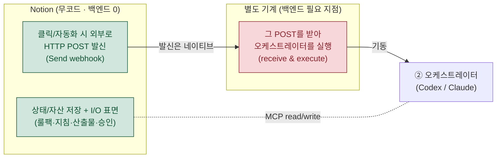
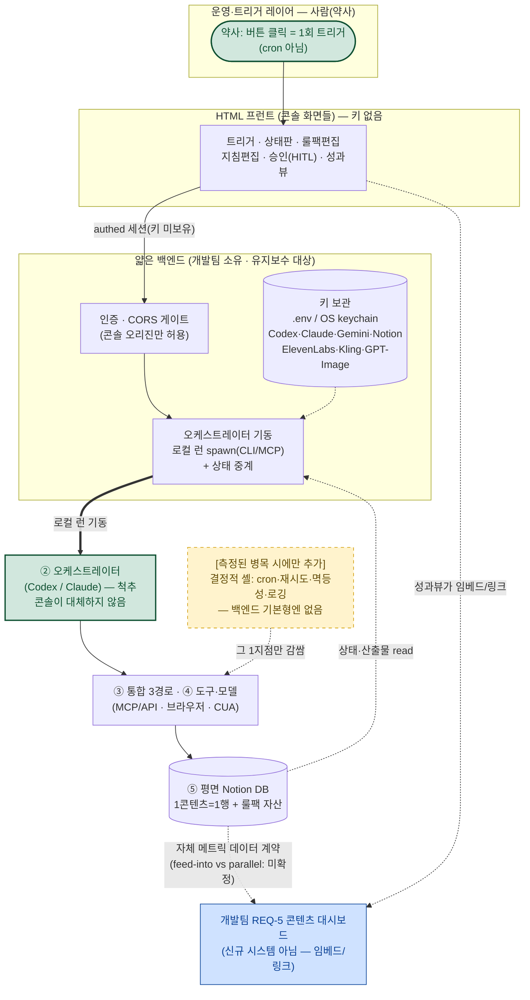

# 오케스트레이션 관리·조작 방법 제안 — 운영 콘솔 설계

## 1. 요약 — 핵심 결론과 권고 경로

이 제안서는 "운영 콘솔로 오케스트레이션을 *조작*한다"는 모호한 요구를, **비용이 자릿수로 다른 두 가지 제어 모델로 정확히 쪼개** 답한다. 흐리면 안 되는 단 하나의 사실: **프롬프트 중심 오케스트레이터(세션 속 Codex/Claude)는 상시 실행 서비스가 아니다.** 따라서 "콘솔로 조작"은 다음 둘 중 하나를 뜻하며, 본 제안은 이 둘을 절대 뭉뚱그리지 않는다.

- **(모델 1) 콘솔 = 상태/자산 저장 + 입출력(I/O) 표면, 사람이 러너.** 룰팩·지침·산출물·승인 상태를 담고, 사람(약사)이 읽고 편집한 뒤 오케스트레이터를 **발차(kick)** 한다. → **Notion이 거의 코드 없이 수행. 유지보수 백엔드 ≈ 0.**
- **(모델 2) 콘솔 = 클릭하면 오케스트레이터를 실행시키는 트리거.** → 키를 들고 API를 호출하는 **유지보수되는 작은 백엔드(수신기)가 필수.**

**★ 권고: MVP는 모델 1을 기본값으로 채택한다.** 모델 1만이 *오늘 확정적으로* 백엔드 0이며, 회의가 택한 '사람 1회 트리거, cron 아님' 입장과 그대로 정합한다. 모델 2(클릭-실행)는 회의가 프롬프트 중심을 고른 *바로 그 이유*였던 유지보수 부담을 처음부터 떠안는 것이고, 그 '백엔드 0' 변형(오케스트레이터 본체가 자체 인바운드 URL을 갖는 경우)은 아직 **미확인(open item)** 이다. 따라서 모델 2는 처음부터 깔지 않고, **수동 발차가 실제 병목으로 *측정*될 때 그 한 점만 외과적으로 승격**한다(개발팀 REQ-5 대시보드와 통합).

| 권고 경로 | 무엇 | 누가 만드나 | 시점 |
|---|---|---|---|
| **MVP(권고)** | 모델 1 — Notion 운영 콘솔(무빌드). 사람이 세션에 지침·룰팩을 붙여 발차 | 약사 단독(코드·호스팅 0) | 즉시 |
| **빌드 경로(조건부)** | 모델 2 — HTML 콘솔 + 얇은 백엔드. 클릭=로컬 런 기동 | 개발팀(상시 유지보수) | 수동 발차 병목이 *측정된* 뒤 |

**왜 발차는 병목이 아닌가:** 회의의 1순위 고통(PP-1)이 지목한 진짜 문제는 "제작 중 다수 툴을 사람이 옮겨 붙이는 핸드오프"이지 "사람이 사이클을 시작하는 행위 자체"도, "무인 24/7 운영"도 아니다. 한 사이클을 사람이 한 번 시작하면 에이전트가 끝까지 핸드오프하는 것만으로 PP-1은 해소된다. 그래서 모델 1이 1순위 과제를 그대로 충족하면서 비용이 0이다.

> 이 설계의 강점은 **금지된 등식("Notion이 네이티브 웹훅을 쏘니 백엔드가 전혀 필요 없다 + 클릭=실행")을 구조적으로 차단**한다는 점이다. 아래 2장에서 발신(send)과 수신·실행(receive & execute)을 두 축으로 분리해, 모델 2의 '백엔드 0' 주장을 검증되지 않은 조건부로만 거론한다.

---

## 2. ★ 제어 계약(Control Contract) — 두 모델·비용·권고 (이 제안서의 척추)

이 장은 제안서 전체의 척추다. "콘솔로 조작"을 비용이 다른 두 모델로 확정하고, Notion 무코드가 어디까지 되고 어디부터 백엔드가 필수인지 사실로 경계를 긋는다.

> **금지 문구(문서 전체에 적용):** "Notion이 오케스트레이션을 관리한다"는 표현은 비용이 자릿수로 다른 두 모델을 뭉갠 말이며, **본 제안은 이를 금지한다.** 항상 "Notion이 무엇을 담고/발신하는가"와 "무엇이 그 신호를 받아 실행하는가"를 분리해 말한다.

### 2.1 두 제어 모델 — 정면 대비

| | **모델 1 — 상태/자산 + I/O 표면** | **모델 2 — 클릭-실행 트리거** |
|---|---|---|
| **콘솔의 역할(무엇을)** | 룰팩 4슬롯·오케스트레이터 지침·단계별 산출물·HITL 승인 상태를 **담고 보여주는 그릇.** 사람이 읽고 편집한 뒤 오케스트레이터를 **발차(kick)** 한다. 콘솔은 입출력 *표면*일 뿐 실행 주체가 아니다. | 콘솔의 버튼을 누르면 오케스트레이터 런을 **실제로 시작**시키는 *트리거.* 클릭이 곧 한 사이클의 자동 기동이다. |
| **누가 러너인가** | **사람(약사)이 러너.** 세션을 열고, 지침을 붙여 사이클을 돌리고, 산출물을 다음 단계로 핸드오프한다. | **콘솔 뒤의 코딩된 작은 서비스(수신기)가 러너.** 클릭 신호를 받아 키를 들고 API를 호출해 오케스트레이터를 기동한다. |
| **유지보수 부담** | **거의 0.** Notion이 코드 없이 수행(2.2 검증). 약사 단독으로 만들고 고친다. | **유지보수되는 백엔드가 필수.** 키 보관·인증·재시도·로깅을 떠안은 상시 코드. 비개발 1인이 단독으로 짓거나 고칠 수 없다(개발팀 의존). |
| **회의 입장과의 정합성** | **정합.** '사람 1회 트리거, cron 아님'과 그대로 일치. 결정적 셸을 비워 두는 MVP 정신을 깨지 않는다. | **충돌.** 회의가 프롬프트 중심을 택한 *바로 그 이유*였던 유지보수 부담이며, "코딩 스케줄러를 이름만 바꿔 다시 들이는 것"이다. '사람 1회 트리거'와도 상충(트리거가 사람 손을 떠난다). |

핵심: **두 모델의 차이는 '러너가 사람이냐 코드냐'다.** 모델 1에서 사람이 하던 "신호 받아 실행"을 모델 2는 상시 코드에게 넘긴다 — 그 코드가 곧 회의가 후순위로 둔 백엔드다.

### 2.2 경계선 — Notion 무코드로 어디까지, 어디부터 백엔드 필수인가 (Phase 1 검증 기반)

Phase 1 검증의 정직한 결론은 **두 축을 분리**해야 성립한다. `requiresMaintainedBackend`(유지보수 백엔드 필요 여부)는 **Notion의 속성이 아니라 '수신기(receiver)'의 속성**이다.

> **한 줄 경계선: '발신(send)'은 Notion 네이티브로 백엔드 0이다. '수신+실행(receive & execute)'은 Notion이 아니라 별도 기계의 일이다. 이 둘을 등치하면 오판이다.**



검증된 사실을 능력별로 확정한다(추정 아님 — 공식 도움말/툴 인벤토리 high-confidence).

| 능력 | Notion 무코드로 되나 | 백엔드 필요 | 판정 근거 |
|---|---|---|---|
| **상태/자산 저장 + I/O 표면** (룰팩·지침·산출물·승인 상태를 담고, 콘솔↔Notion 읽기·쓰기) | **예** | 불필요 | MCP/API의 `notion-fetch`/`notion-search`(읽기)·`notion-create-pages`/`notion-update-page`(쓰기) **능력**이 검증됨. **모델 1의 토대.** (단, 10단계 대량 적재에 대한 토큰 권한 범위·레이트리밋 *충분성*은 미확인 → 6.2·부록 7.1 참조.) |
| **클릭/자동화 시 외부로 HTTP POST 발신** (`Send webhook` 액션) | **예** | 불필요(발신부 한정) | 버튼·DB자동화의 정식 네이티브 액션. POST 전용, 커스텀 헤더 지원, **유료 플랜 전용**. '사람 1회 트리거'와 정확히 일치하는 수동 단일 트리거(버튼). high-confidence. |
| **그 POST를 받아 세션 속 오케스트레이터를 *실행*** (receive & execute) | **아니오** | **필수** | Notion은 POST를 '쏠' 수만 있다. 받아서 Codex/Claude 본체(공개 URL 없는 로컬 CLI/에이전트)를 기동하는 **수신기는 반드시 별도**다. **모델 2가 백엔드 없이는 닫히지 않는 지점.** |
| **오케스트레이터 자체 인바운드 URL을 버튼이 직접 타격** | 조건부 | **0일 수도(미확인)** | 이것만이 사용자 유지보수 백엔드가 진짜 0인 경로. 단 Codex/Claude 본체가 공개 인바운드 트리거 URL을 네이티브 제공하는지 **미확인(open item)**. 미제공이면 성립 불가 — **확정하지 말고 조건부로 둔다.** |

**사실 판정:**

- **모델 1(사람이 러너 + Notion 표면)은 오늘 *확정적으로* 백엔드 0이다.** 사람이 곧 수신기이자 실행자이므로 어떤 자동 트리거 메커니즘도 필요 없다.
- **모델 2(자동 클릭-실행)는 *확정적으로* 백엔드 0인 경로가 현재 없다.** 모든 자동 경로는 (a) 유지보수 수신기가 필요하거나(벤더 Zapier/Make = 낮은 부담이나 SaaS 비용·여전히 본체 인바운드 전제, 자체 서버리스 = 중간 부담·개발팀), (b) 오케스트레이터 자체 인바운드 URL에 의존하는데 그것이 **미확인**이다. 따라서 모델 2의 '백엔드 0' 주장은 **검증되지 않았다(unconfirmed) → 조건부로만 거론**한다.

> **함정 주의:** ① "Notion이 네이티브 웹훅을 쏜다 = 백엔드가 전혀 필요 없다"는 등치는 틀렸다(발신은 네이티브, 수신·실행은 별도 기계). ② 무코드 `Send webhook` 액션과 개발자 `API 웹훅(이벤트 구독)` 은 **별개 메커니즘**이므로 혼용 금지 — 전자=Notion이 능동 발신(버튼/자동화), 후자=데이터 변경 이벤트 구독(공개 URL 수신기 등록·HMAC 검증 필요).

### 2.3 ★ 권고 — MVP 기본값은 모델 1, 승격은 측정 후 한 점만

> **본 제안의 입장: MVP 제어 모델은 '모델 1 = 사람이 러너 + Notion 표면'을 기본값으로 채택한다. 모델 2(클릭-실행)는 측정된 필요가 확인될 때 그 지점만 외과적으로 승격한다.**

이는 **빌드 선택지 A(=Notion을 콘솔로, 호스팅·코드 0)** 와 같은 결정이다. **모델 1 = 선택지 A. 모델 2 = 선택지 B(얇은 백엔드)의 트리거 책임.**

콘솔이 관리할 6가지 기능(3장) 중 **'트리거'만 모델 간 차이가 있고**, 나머지 5가지(지침·룰팩·진행/산출물·HITL·성과)는 두 모델 모두 Notion 표면(모델 1 토대)에서 수행된다. 승격 규칙은 6장에 둔다.

### 2.4 '발차(kick)'의 구체적 의미 — 사람이 러너일 때

모델 1에서 발차는 **HTTP POST가 아니라 사람의 행위**다. 한 사이클은 다음 순서로 시작·진행된다.

1. **세션 시작 + 지침 부착.** 약사가 Codex/Claude 세션을 연다. 오케스트레이터 **지침(시스템 프롬프트: 3대 책임 + 모델 라우팅 규칙 + 활성 룰팩 4슬롯)** 을 붙이고, **어느 콘텐츠 행(평면 DB의 1행)·어느 단계부터** 돌릴지 포인터를 준다. 이것이 발차다.
2. **상태 풀-인(pull-in) — 웹훅 페이로드가 아니라 MCP 조회로.** 오케스트레이터가 Notion에서 해당 행의 직전 산출물·승인 상태·룰팩을 **MCP `notion-fetch`/`notion-search`로 끌어온다.**
   - **★ 모델 1이 모델 2의 페이로드 한계를 비껴가는 지점:** 모델 2의 `Send webhook`은 페이지 *속성*만 보내고 본문(블록)은 못 싣으며 ~500KB/1,000블록 제한이 있다 → 산출물 본문은 식별자만 보내고 수신측이 풀-페치해야 한다. 모델 1은 **애초에 페이로드가 없다.** 사람이 행 포인터만 주면 오케스트레이터가 MCP로 본문째 끌어온다. 핸드오프가 구조적으로 단순하다.
3. **사이클 실행 + 산출물 핸드오프.** 오케스트레이터가 단계를 순차 호출(경로1 MCP/API 우선 → 조건부 브라우저 → 폴백 CUA)하고, 각 단계 산출물을 **MCP `notion-create-pages`/`notion-update-page`로 같은 행에 적재.** 핸드오프는 Notion 행을 매개로 한다.
4. **막히면 멈추고 보고.** 실패·미확인 경로·검수 지점에서 자동 진행을 멈추고 사람에게 보고. LLM 지시로 1회 재시도 후 멈춤(자동 폴백 금지).
5. **HITL 게이트 + 다음 발차.** 약사가 발행 전 체크리스트(근거 있나·과장 없나·출처 있나)를 본인 확인·승인하고, 승인 상태를 행에 기록한다. 다음 단계/사이클이 필요하면 **다시 1번으로 발차** — 즉 발차는 한 사이클당 사람의 명시적 1회 행위이며, 이것이 곧 '사람 1회 트리거, cron 아님'의 물리적 실체다.

> 모델 2로 승격하면 위 1번의 "세션 열고 지침 붙여 발차"만 "버튼 클릭 → 수신기가 지침을 붙여 세션 기동"으로 대체된다. 2~5번은 그대로다 — 승격이 바꾸는 것은 *트리거 한 점*뿐이다.

---

## 3. 무엇을 관리·조작하는가 — 6대 기능

운영 콘솔이 관리할 기능은 6가지다. **#2 '지침 편집'은 빠뜨리기 쉬우므로 명시적으로 포함**한다. 6가지 중 *트리거(#1)* 만 모델 1/모델 2 차이가 있고, 나머지는 두 모델 공통으로 Notion 표면에서 수행된다.

| # | 기능 | 무엇을 조작하나 | 모델 1(MVP)에서 | 모델 2(빌드)에서 |
|---|---|---|---|---|
| 1 | **사이클 트리거** | 한 콘텐츠 사이클을 시작 | 사람이 세션에 지침·룰팩 붙여넣기(2.4) | 버튼 클릭 → 백엔드가 로컬 런 기동 |
| 2 | **오케스트레이터 지침 편집** | 시스템 프롬프트(3대 책임·모델 라우팅·"막히면 멈춤") 버전 보기·편집 | Notion '지침' 페이지(버전 이력) | `GET/PUT /instructions` |
| 3 | **룰팩 4슬롯 편집·스왑** | A 규제·B 암묵지·C 스코어링·D 소스채널 편집, 버티컬 교체 | DB-2 룰팩 DB(4.1·스왑 4.5) | `GET/PUT /rulepacks` |
| 4 | **진행 상태·산출물 보기** | 10단계 진행·단계별 산출물·막힘 보고 | DB-1 칸반 뷰(4장) | `GET /cycles/:id`, `/artifacts`(폴링·SSE) |
| 5 | **HITL 발행 전 승인** | 근거 있나·과장 없나·출처 있나 체크리스트 승인/반려 | DB-1 승인 뷰(G1/G2/G3 체크박스) | `POST /cycles/:id/approve` |
| 6 | **성과 대시보드** | 조회·참여율 등 성과 환류 | 자체 메트릭(Notion DB) + 수동/CSV | 개발팀 REQ-5 대시보드 임베드/링크 |

> **#6은 의도적으로 조건부다(범위 표시).** 성과 데이터원(Updoc·Blavue)의 API/MCP 가용성이 모두 **미확인(unconfirmed)** 이고, 개발팀 REQ-5 대시보드와의 데이터 계약(자체 메트릭이 유입(feed-into)인지 병렬(parallel)인지)도 미확정이다. 따라서 #6은 단정하지 않고 **자체 메트릭 즉시 산출 + 외부 지표 수동/CSV**로 1차 가치를 확보하고, 가용성이 확인되면 자동 수집·임베드로 승격한다. 나머지 5기능은 모델 1로 **기능적으로 충족**된다(능력은 검증, 단 #4·#3의 대량 적재 *충분성*은 2.2·부록의 open item).

---

## 4. MVP — Notion 운영 콘솔 (무빌드, 사람이 러너)

이 장은 모델 1을 **바로 세팅 가능한 구체 아티팩트**로 제시한다. 콘솔은 오케스트레이터(척추)를 **대체하지 않는다** — 상태/자산을 담고 사람이 발차하는 표면이다.

### 4.1 페이지/DB 구조 — 바로 만들 3종

평면 원칙(1콘텐츠=1행, Relation 최소)을 지킨다.

```
📁 운영 콘솔 (Notion Workspace/Teamspace)
├── 🗂️ DB-1  콘텐츠 파이프라인 보드   ← 1콘텐츠=1행, 칸반
│     └── 👁️ 뷰: 발행 전 승인 뷰      ← DB-1의 필터 뷰 (별도 DB 아님)
├── 🗂️ DB-2  도메인 룰팩 DB           ← 1버티컬=1행, 4슬롯 A/B/C/D
├── 📄 오케스트레이터 지침 (시스템 프롬프트 마스터 + 발차 템플릿)
└── 📄 콘솔 사용법 / 운영 플레이북
```

> **왜 승인은 별도 DB가 아니라 뷰인가:** 승인 체크리스트는 "검수대기 상태인 같은 콘텐츠 행"을 보는 화면일 뿐이다. 승인만을 위해 관계형 DB를 더 만드는 것은 평면/무관계 원칙에 어긋난다. "최소 세 구조"는 **DB 2개 + 뷰 1개**로 충족 — 과설계로 세 번째 DB를 만들지 않는다.

#### DB-1 콘텐츠 파이프라인 보드 (1콘텐츠 = 1행)

10단계 산출물을 한 행에 담는다. 산출물 **본문(각본 전문·카드뉴스 카피)은 행의 페이지 안 블록**에 두고, 속성에는 **요약/링크/완료 마커**만 둔다.

| 속성명 | 타입 | 용도 |
|---|---|---|
| 아이템명/주제 | **Title** | 콘텐츠 식별(1행=1콘텐츠) |
| 버티컬 | **Relation→DB-2**(또는 Select) | 어느 룰팩으로 분석했나. 단일 버티컬이면 Select로 시작 |
| 현재단계 | **Select** | 10단계 중 어디(①트렌드…⑩환류) — *진행상태와 직교* |
| 진행상태 | **Status** | 대기/진행/막힘/검수대기/승인/발행 (4.2) — 칸반 그룹 기준 |
| 출처 채널 | **Select** | 올리브영/약국/아모레/LG/프란츠/인플루언서 (룰팩 D) |
| 품질 점수·순위 | **Number** | ③스코어링 결과 |
| 평가 근거 | **Rich text** | 근거가 룰팩 어느 슬롯(A/B/C)·항목에서 나왔나(추적성) |
| ④기획 요약 | **Rich text** | 소크라테스 기획 결론(본문은 페이지에) |
| ⑤후킹 문구 | **Rich text** | 후킹 카피 — 환류 재사용 대상 |
| ⑤각본(Canonical) | **URL/Rich text** | 채널중립 원본 위치(본문은 페이지 블록) |
| ⑥영상 산출물 | **Files/URL** | GPT이미지→Hailuo→Kling 결과 링크 |
| ⑦카드뉴스 산출물 | **Files/URL** | 카드뉴스 이미지/카피 묶음 링크 |
| ⑧편집본 | **URL** | ElevenLabs 음성/Premiere 편집 결과 |
| 플랫폼 | **Multi-select** | 인스타/틱톡/유튜브 |
| G1 사실성·근거 | **Checkbox** | 발행 전 게이트 — 근거가 룰팩 A에 연결되나 |
| G2 과장광고 없음 | **Checkbox** | 효능 단정·금지표현·무출처 주장 없음 |
| G3 출처 명시 | **Checkbox** | 주장에 출처가 있나 |
| 승인자/승인일 | **Person/Date** | 약사 본인 승인 기록(규제 감사 흔적) |
| 막힘 사유 | **Rich text** | 진행상태=막힘일 때 오케스트레이터가 기록(에스컬레이션) |
| 성과(조회/참여율) | **Number** | ⑩환류(데이터원 미확인 → 수동/CSV) |
| 잘 먹힘 | **Checkbox** | 정렬 필터로 다음 사이클 ①·⑤ 재사용 후보 |

> **단일 상태 속성(충돌 금지):** 콘텐츠 라이프사이클을 표현하는 상태 속성은 **`진행상태`(Status) 하나뿐**이다. 별도의 `검수 상태`(미검수/검수중/승인/반려)를 평행으로 두지 않는다. `검수대기`=검수 필요, `승인`=승인, **반려는 별도 값 없이 진행상태를 `막힘`/`진행`으로 되돌리고 `막힘 사유`에 반려 사유 기록**으로 처리한다. 미검수→검수중→승인→반려 상태머신을 별도로 운영하는 것은 1인 운영에 과한 자기 관료화이므로 채택하지 않는다(발행 전 체크리스트 한 장으로 충분).

#### DB-2 도메인 룰팩 DB (1버티컬 = 1행, 4슬롯 A/B/C/D)

| 속성명 | 타입 | 용도 |
|---|---|---|
| 버티컬 | **Title** | cosmetics/food/supplement/fashion/electronics/finance |
| 활성 | **Checkbox** | 현재 오케스트레이터에 바인딩된 룰팩(4.5 스왑 — 항상 1개만 체크) |
| 슬롯A 마지막 갱신 | **Date** | 규제 데이터 갱신일 |
| 슬롯A 근거 고시 | **Rich text** | 갱신 근거(식약처 고시 등) |
| 슬롯B 검수자 | **Person** | 암묵지 슬롯 — 전문가(약사) 검수 필수 |
| 변경 메모 | **Rich text** | 최종 수정 한 줄 |

**행=페이지 본문 구조 — 단일 권위 소스 원칙(★ 드리프트 방지):**

규제 도메인에서 "사람이 읽는 4슬롯 토글"과 "오케스트레이터가 주입하는 직렬화본"이 따로 갱신되면, 사람은 한 버전을 읽고 에이전트는 다른 버전을 쓰는 **단일 진실 위반(정확성·규제 리스크)** 이 생긴다. 이를 막기 위해 **권위 소스를 하나로 고정한다.**

- **권위 소스 = 사람이 읽고 편집하는 4슬롯 토글** `[A] 규제·공식 기준` / `[B] 내부 휴리스틱` / `[C] 스코어링 루브릭` / `[D] 수집 소스 채널`. 약사는 **여기 한 곳만** 갱신한다.
- **`[직렬화] rulepack.yaml` 코드블록은 위 토글에서 *파생*되는 1회 변환 산출물**이다(독립 권위 소스가 아니다). 발차 시 약사(또는 오케스트레이터)가 토글 내용을 그대로 직렬화해 주입한다 — 스키마는 고정, 내용만 토글에서 옮긴다. 즉 편집은 **단방향(토글 → 직렬화)**, 약사는 결코 양쪽을 따로 고치지 않는다.

```
▸ [A] 규제·공식 기준   — 1차 자료 수치/기준(출처 명확). ← 권위 소스
▸ [B] 내부 휴리스틱     — 업계 암묵지(전문가 검수 필수, AI 자동생성 금지). ← 권위 소스
▸ [C] 스코어링 루브릭   — 점수·가중치. ← 권위 소스
▸ [D] 수집 소스 채널    — 권위 채널 + 인플루언서. ← 권위 소스
▸ [직렬화] rulepack.yaml — 위 4슬롯에서 파생(발차 시 1회 변환). ← 파생물, 직접 편집 금지
```

#### 발행 전 승인 뷰 (DB-1의 필터 뷰)

- **필터:** `진행상태 = 검수대기`
- **보이는 컬럼:** 아이템명 / 현재단계 / ⑤후킹 문구 / 평가 근거 / **G1·G2·G3 체크박스** / 승인자 / 막힘 사유
- **사용:** 약사가 G1/G2/G3를 모두 체크 → 진행상태를 `승인`으로 변경 → 행이 이 뷰에서 자동 사라짐(필터 이탈) → 발행 단계로.

| 게이트 | 속성 | 확인 내용 |
|---|---|---|
| G1 | 사실성·근거 | 스코어링 근거가 룰팩(A) 규제 기준에 실제 연결되나. 무근거 점수는 보류 |
| G2 | 과장광고 없음 | 효능 단정·규제 금지표현·무출처 주장 없음(의약품적 효능 오인 특히 주의) |
| G3 | 출처 명시 | 주장에 출처가 있나 |

자동 게이트는 "발행 전 LLM이 과장 표현 의심 항목을 한 번 짚어주는" **보조**로만(통과/차단 강제 안 함). 최종 승인은 약사 본인(규제 도메인).

### 4.2 상태 흐름 + 칸반 뷰

**핵심: 상태는 직교 2축이다.** `현재단계`(Select, ①~⑩)와 `진행상태`(Status)를 한 속성으로 합치면 "⑥영상 단계가 막혔다"를 표현할 수 없다.

| 진행상태 값 | 의미 | Notion Status 그룹 | 누가 만드나 |
|---|---|---|---|
| **대기** | 단계 시작 전(큐 적재) | To-do | 사람(행 생성 시) |
| **진행** | 오케스트레이터가 현재단계 작업 중 | In-progress | 오케스트레이터 |
| **막힘** | 실패·미확인 경로·에스컬레이션(막힘 사유 기록) | In-progress | 오케스트레이터(멈추고 보고) |
| **검수대기** | 산출물 완료, 약사 확인 필요(HITL) | In-progress | 오케스트레이터 |
| **승인** | 약사가 G1~G3 통과·승인 | Complete | 사람(승인 뷰) |
| **발행** | ⑨발행 완료 | Complete | 사람/오케스트레이터 |

```
대기 ──(KICK)──▶ 진행 ──┬──▶ 검수대기 ──(G1·G2·G3 OK)──▶ 승인 ──▶ 발행 ──▶ (⑩환류)
                        │                  │
                        └──▶ 막힘          └──(반려)──▶ 막힘/진행 (막힘 사유에 반려 사유)
                             │
                        (사람이 막힘 사유 해소 후 → 진행 재개)
```

**칸반 뷰 3종:** ① 메인 칸반(그룹=진행상태, 콘솔 대문, 막힘 카드 빨강) ② 단계 보드(그룹=현재단계, ①~⑩) ③ 승인 뷰(필터=검수대기, HITL 전용). 보조: 막힘 필터 뷰, 잘 먹힘 정렬 뷰.

### 4.3 트리거 동선 — 사람이 러너 (모델 1, 백엔드 0)

오케스트레이터는 상시 실행 서비스가 아니다. 한 사이클 = "사람이 발차 → 에이전트가 끝까지 핸드오프 → 막히면 멈춤."

1. **행 생성:** DB-1 `대기` 컬럼에서 `+ New` → 아이템명/주제, `버티컬` 지정(=DB-2 활성 룰팩과 일치), `현재단계=①트렌드수집`.
2. **룰팩 직렬화:** DB-2 활성 룰팩 행 열기 → 4슬롯 토글을 `[직렬화] rulepack.yaml`로 1회 변환(4.1 단방향 원칙).
3. **발차 템플릿 조립:** `오케스트레이터 지침` 페이지의 발차 템플릿 복사해 채운다:
   ```
   [시스템 프롬프트: 오케스트레이터 마스터 지침 — 10단계·모델 라우팅·"막히면 멈추고 보고"]
   [룰팩]
   <2번에서 직렬화한 rulepack.yaml 붙여넣기>
   [대상]
   Notion 페이지 ID/공유링크: <DB-1 행>
   [작업]
   ①트렌드수집부터 시작. 각 단계 산출물을 위 페이지에 Notion MCP로 적재하고
   현재단계/진행상태 속성을 갱신하라. 발행 직전 진행상태=검수대기로 멈추고 보고하라.
   ```
4. **붙여넣기·발차:** 위 블록을 Codex/Claude(데스크탑 앱 + 로컬 MCP) 세션에 붙여 전송. **이 한 번이 '사람 1회 트리거'다.**
5. **에이전트 실행:** 오케스트레이터가 단계를 순차 호출하며 MCP 경로 단계는 산출물·상태를 Notion에 자동 적재, 진행상태 `진행` 유지, 현재단계 전진.
6. **막힘 시:** 진행상태=`막힘`, `막힘 사유` 기록 후 보고 → 약사 조치 → 세션에 후속 지시.
7. **검수대기:** 발행 직전 진행상태=`검수대기` → 약사가 승인 뷰에서 G1/G2/G3 체크 → `승인`.
8. **발행·환류:** ⑨발행 후 진행상태=`발행`. ⑩성과는 데이터원 미확인이라 수동/CSV 입력 → `잘 먹힘` 체크 시 다음 사이클 재사용.

**산출물 적재 — 경로별로 다름:**

| 단계 유형 | 적재 방식 | 근거 |
|---|---|---|
| **MCP 경로**(①트렌드·④기획·⑤각본·Notion 적재 전반) | 오케스트레이터가 `notion-update-page`/`notion-create-pages`로 자동 적재(본문=블록, 요약/링크=속성) | 능력 검증됨(단 대량 적재 충분성은 open item) |
| **API 직결**(⑥GPT이미지→Hailuo→Kling) | 산출물 파일/URL을 `⑥영상 산출물` 속성에 링크 적재 | 본문 아닌 링크라 속성 가능 |
| **비MCP/디바이스**(⑧Premiere, 미확인 Updoc/Blavue/Clova) | **수동 복붙** — 사람이 결과 링크/CSV를 속성에 입력 | 자동 경로 미확인 → 정직히 수동 |

### 4.4 무코드 발신부 — 미래 연결용 신호 (실행 아님)

Notion은 별도 코딩 백엔드 없이 네이티브로 외부 HTTP POST를 **쏜다**(공식 도움말 high-confidence). 단 이 발신은 **신호일 뿐, 수신기가 없으면 오케스트레이터를 실행시키지 않는다.** 따라서 아래 표의 라벨은 "실행"이 아니라 "발신/알림" 의미로 명명한다(라벨이 캐비엇과 분리되어 콘솔/슬라이드에 단독 노출될 때 '클릭=실행'으로 오인되는 것을 막기 위함).

| 무코드 발신부(신호만 — 실행은 수신기 필요) | 메커니즘 | 트리거 |
|---|---|---|
| **🔔 [사이클-시작 신호 발신]** | 버튼 블록 'Send webhook' | 약사 클릭(사람 1회 트리거와 정합) |
| **🔔 [검수요청 알림 보내기] / [발행 신호 발신]** | 버튼/DB버튼 'Send webhook' | 약사 클릭 |
| **속성 변경 알림 발신** | DB자동화: Property edited(예: 진행상태→검수대기) → Send webhook | 무인(상태 변경 시 알림) |
| **(파킹) 예약 신호 발신** | DB자동화: Recurring → Send webhook | Notion 단독 스케줄 — **'cron 아닌 사람 1회 트리거' 선호로 우선순위 낮음, 보관만** |

**제약(설계에 반영):** POST만(GET/PUT 불가), 자동화당 웹훅 최대 5개. **페이지 본문/블록 전송 불가(속성만), ~500KB/1,000블록** → 페이로드엔 페이지 ID 등 최소 식별자만, 수신측이 Notion API로 풀-페치. **기본 무인증** → 규제 도메인이므로 **커스텀 헤더에 시크릿 토큰**으로 수신측 인증 필수(무인증 트리거 노출 금지). **유료 플랜 전용**(무료는 Slack 알림만) → [open item] 현재 플랜 확인.

> **★ MVP 권고:** **수신·실행부는 MVP 범위 밖이다.** MVP는 모델 1(사람이 세션에 복붙=발차)로 완결한다 — 버튼이 없어도 동작한다. 위 발신부는 **"미래에 수신기가 확보되면 그날 바로 연결할 무코드 발신부"** 로 미리 만들어 두되, **현재는 알림/로깅 용도**(예: 진행상태→검수대기 시 Slack/이메일 핑)로만 쓴다. 권고 MVP는 이 버튼들을 아예 만들지 않아도 무방하다.

### 4.5 룰팩 교체(버티컬 스왑) 절차

세로축(버티컬) 확장은 DB-2에서 4슬롯만 갈아끼우는 일이며 단계 재설계는 없다.

1. **새 행 추가:** 버티컬명 입력(예: `supplement`). 기존 화장품 행 복제로 4슬롯 토글 틀 재사용.
2. **4슬롯 채우기(권위 소스):** `[A]`=1차 자료만(건기식=기능성원료 인정목록·일일섭취량) + 갱신일/근거 기입 / `[B]`=암묵지, `슬롯B 검수자`=약사 본인(전문가 검수 필수) / `[C]`=가중치(금융 등 규제 민감 버티컬은 (A) 필수고지 누락을 차단 조건으로) / `[D]`=권위/인플루언서 풀.
3. **활성 전환:** 새 행 `활성=체크`, 기존 행 `활성=해제`(항상 1개만 — 단일 진실).
4. **발차 시 직렬화·주입:** 4.3 동선대로, 활성 룰팩의 4슬롯을 `rulepack.yaml`로 1회 변환해 발차 템플릿 `[룰팩]`에 붙여넣기. ①·③단계에 주입된다.
5. **검증 1회:** 첫 콘텐츠는 ③스코어링의 `평가 근거`가 새 슬롯(A/B/C) 항목을 실제 인용하는지 약사가 확인(추적성). 통과하면 정규 운영.

가로축(채널) 확장은 룰팩과 무관 — Canonical 원본(⑤)에 ⑥/⑦/⑧ 어댑터만 추가, DB-1 `플랫폼` Multi-select에 채널 추가로 충분.

### 4.6 운영 플레이북 (일일 / 사이클 / 막힘 시)

**일일(5분):** ① 메인 칸반 `막힘` 컬럼 먼저 확인·조치 → ② 승인 뷰 `검수대기` G1/G2/G3 검수 → ③ `발행` 건 ⑩성과 수동/CSV 입력·`잘 먹힘` 판정 → ④ `대기` 큐에 신규 주제 추가.

**사이클 단위:** 시작=행 생성→룰팩 직렬화→발차 템플릿 붙여넣기(4.3) / 진행 중=콘솔은 보기만, 비MCP 단계만 사람이 속성 입력 / 검수=체크박스 3개+승인 / 발행 후=성과+잘먹힘.

**막힘/실패 시 조작:**

| 막힘 원인 | 약사 조작 |
|---|---|
| 단계 실패(예: 영상 비동기 실패) | 막힘 사유 확인 → 세션에 "그 단계 1회 재시도" 지시. 반복 누락이 **측정되면** 그 1지점만 결정적 셸 추가 |
| 미확인 툴 경로(Updoc/Blavue/Clova/⑨발행) | 자동 폴백 금지 → 해당 단계 **수동 수행** 후 산출물 속성에 붙여넣고 "다음 단계 진행" 지시 |
| 검수 반려(G1~G3 미충족) | 진행상태를 `막힘`/`진행`으로 되돌리고 `막힘 사유`에 반려 사유 → 세션에 수정 지시 → 재산출 후 재검수 |
| 웹훅 자동화 일시정지(쓰는 경우) | Notion 자동화 설정에서 수동 재개. 무인증 노출 점검(시크릿 헤더) |
| MCP 적재 실패/레이트리밋 | [open item] 토큰 권한·레이트리밋 실측 미확인 → 실패 시 수동 적재로 폴백, 빈도 측정 |

> **MVP 운영 철학:** 콘솔은 *상태/자산 표면*이고 사람이 러너다. cron·멱등성·상태머신·구조화 로깅은 MVP에 넣지 않는다. 무인 발신 버튼은 만들어 두되, 그 신호가 오케스트레이터를 *실행*시키려면 수신기(백엔드)가 필요하며 그 비용은 측정된 병목에만 외과적으로 진다.

---

## 5. 빌드 경로 — HTML 콘솔 + 얇은 백엔드 (모델 2, 개발팀)

> **이 장 전체의 전제:** 여기는 제어 계약 **'모델 2(클릭-실행)'** 를 *실제로 구현*할 때의 경로다. 모델 2는 **유지보수되는 백엔드가 필수**이고, 그 백엔드의 소유·운영 주체는 **개발팀**이다(비개발 1인 약사가 아니다). **이것은 MVP가 아니다.** 권고는 여전히 모델 1(4장)이며, 이 장은 "모델 1로 측정된 병목이 누적되어 콘솔이 '읽기·편집'을 넘어 '클릭=실행'까지 책임져야 한다는 필요가 *실제로 발생했을 때*" 개발팀에 넘기는 설계도다.

### 5.1 콘솔이 얹히는 위치 — 세 컴포넌트 분리

콘솔은 운영·트리거 레이어(사람=약사) **위에 얹히는 표면**이다. 오케스트레이터(척추)를 **대체하지 않는다.** 콘텐츠 판단·모델 라우팅·단계 핸드오프 추론은 여전히 척추가 한다. 핵심은 **세 컴포넌트를 절대 한 덩어리로 뭉뚱그리지 않는 것**이다.

| 컴포넌트 | 책임 | 정체성 |
|---|---|---|
| **HTML 프런트(콘솔 화면)** | 사람이 읽고/편집하고/버튼 누르는 표면. 키를 **절대 갖지 않음.** | 정적 표면 |
| **얇은 백엔드** | (a) 키 보관 (b) 오케스트레이터 기동(로컬 런 spawn) (c) 상태 중계 (d) 인증·CORS | **유지보수 대상 코드(개발팀 소유)** |
| **결정적 셸** | cron·재시도·멱등성·로깅 | **측정된 병목에만** 외과적으로 추가 — 기본형은 비어 있음 |

> **★ 가장 흔히 무너지는 경계선:** **얇은 백엔드 ≠ 결정적 셸.** 백엔드를 깐다고 cron이 켜지는 게 *아니다.* 백엔드는 "키를 들고 척추를 기동하고 상태를 중계하는" 다리일 뿐이다. cron·재시도·멱등성·로깅은 "매일 새벽 무인 대량 실행" 같은 구체적 무인 운영 필요가 *측정된* 그 한 지점에만 추가한다. 백엔드 존재가 "이제 자동 스케줄 돌려도 된다"로 번지면, 이 장은 회의가 후순위로 둔 '코딩 스케줄러'를 이름만 바꿔 다시 들이는 것이 된다. 이 장의 기본 백엔드에는 **스케줄러 파일이 없다**(5.4).

### 5.2 컴포넌트 구성도



척추(녹색)는 그대로다. 얇은 백엔드(흰색)는 자체 노드로, 척추도 결정적 셸(점선)도 아니다 — 척추를 대체하지도, cron을 켜지도 않는다. 성과 대시보드는 개발팀 REQ-5를 임베드/링크할 뿐 신규 시스템이 아니다.

### 5.3 화면 목록 — 6대 기능 매핑

명명 화면은 5개지만 관리 기능은 6가지다(#2 지침 편집 명시 포함).

| # | 화면 | 기능 | 대응 엔드포인트 |
|---|---|---|---|
| 1 | 사이클 트리거 | (1) 트리거 — 버튼 클릭=백엔드의 로컬 런 기동 | `POST /cycles` |
| 2 | 지침 편집 | (2) 시스템 프롬프트 보기·편집·이력 | `GET/PUT /instructions` |
| 3 | 룰팩 편집 | (3) 4슬롯 편집·버티컬 스왑 | `GET/PUT /rulepacks` |
| 4 | 파이프라인 상태판 | (4) 10단계 진행·산출물·막힘(폴링/SSE) | `GET /cycles/:id`, `/artifacts` |
| 5 | 승인(HITL) | (5) 발행 전 체크리스트 승인/반려 | `POST /cycles/:id/approve` |
| 6 | 성과 대시보드 | (6) REQ-5 대시보드 임베드/링크 | (REQ-5 측, 데이터 계약 미확정) |

화면 5·6은 의도적으로 **얇게** 둔다. #5는 "발행 전 체크리스트 한 장" 입장 그대로 — 상태 머신·강제(enforcement)를 넣지 않는다(자기 관료화 회피). #6은 새 대시보드를 만들지 않고 REQ-5를 끌어온다.

### 5.4 백엔드 최소 엔드포인트

| 메서드·경로 | 용도 | 인증 | 비고 |
|---|---|---|---|
| `POST /cycles` | 트리거 — 새 사이클 기동 | 필수 | 핸들러가 **로컬 오케스트레이터 런을 spawn**(5.5). `{cycleId}` 반환 |
| `GET /cycles/:id` | 사이클 상태 조회 | 필수 | 진행 단계·막힘 보고 |
| `GET /cycles/:id/artifacts` | 단계별 산출물 조회 | 필수 | Notion DB read 결과 중계 |
| `POST /cycles/:id/approve` | HITL 승인/반려 | 필수 | 체크리스트 결과 기록 |
| `GET/PUT /instructions` | 척추 지침 조회·갱신 | 필수 | 버전·이력 |
| `GET/PUT /rulepacks` | 룰팩 4슬롯 조회·갱신 | 필수 | 버티컬 스왑 포함 |
| *(옵션)* `POST /hooks/notion` | Notion '버튼→Send webhook' 수신기 | **시크릿 헤더 검증 필수** | 본문 못 싣음(속성만, ~500KB) → 페이지 ID만 받고 API로 풀-페치 후 `POST /cycles`와 합류 |

### 5.5 'cron 아님' 유지 — 트리거가 실제 런을 시작시키는 법 (정직하게)

Phase 1의 날카로운 지점: **`requiresMaintainedBackend`는 'Notion의 속성'이 아니라 '수신기의 속성'이다.** 이 장의 경로는 **백엔드가 오케스트레이터와 같은 기계에 co-located** 되므로, 사람이 버튼을 누르면 `POST /cycles` → 백엔드 핸들러가 **로컬 오케스트레이터 런을 spawn**(로컬 CLI/MCP 호출)한다. 즉 `POST /cycles`가 "마법처럼 Codex를 실행"하는 게 아니라 백엔드가 로컬 프로세스를 띄운다.

> **★ 정직한 단서(open item을 해결한 게 아니라 치환한 것):** 이 co-located 경로는 "오케스트레이터가 공개 인바운드 URL을 가져야 한다"는 open item을 *제거*하는 대신, **"얇은 백엔드가 로컬에서 Codex/Claude의 자율 멀티스텝 런을 프로그램적으로 spawn할 수 있다"는, 역시 미검증인 가정으로 치환**한다. 따라서 "이 open item이 자체 호스팅 경로엔 걸리지 않는다"가 아니라 **"다른 미검증 가정으로 옮겨가며, 개발팀이 1:1 검증해야 할 open item"** 이 정확한 표현이다. 벤더 수신기(Zapier/Make) 경로에는 본체 인바운드 URL 문제가 그대로 걸린다.

**트리거는 cron이 아니라 사람의 1회 버튼이다.** 결정적 셸(cron·재시도·멱등성)은 측정된 병목에만 — 예: 영상 생성(Hailuo/Kling) 비동기 실패가 반복 누락으로 측정되면 그 호출 1지점만 감싼다. 백엔드 기본형에는 스케줄러가 없다.

### 5.6 최소 스켈레톤 (개발팀 인수인계용)

키 없는 정적 HTML + 얇은 백엔드. **cron/스케줄러 파일 없음.**

```
console/
├─ frontend/                 # 정적 HTML — 키를 절대 갖지 않음. authed 세션으로만 백엔드와 대화
│  ├─ index.html             # 화면 셸(탭): 트리거/상태판/룰팩/지침/승인/성과
│  ├─ app.js                 # fetch만. 모든 호출은 백엔드(/cycles 등)로, 외부 API/MCP 직접 호출 금지
│  └─ views/                 # cycle-trigger, pipeline-status, rulepack-edit,
│                            # instructions-edit, approval, performance(REQ-5 임베드)
└─ backend/                  # 개발팀 소유 · 유지보수 대상. 키는 여기에만.
   ├─ .env(.example)         # 모든 프로바이더 키 — git 커밋 금지. 운영은 OS keychain/secret manager
   ├─ server.ts              # 라우트 등록 + 인증 미들웨어 + CORS(콘솔 오리진만)
   ├─ auth.ts                # 세션/토큰 검증. 무인증 트리거 노출 금지
   ├─ routes/
   │  ├─ cycles.ts           # POST /cycles, GET /cycles/:id, /artifacts, POST /cycles/:id/approve
   │  ├─ instructions.ts     # GET/PUT /instructions
   │  ├─ rulepacks.ts        # GET/PUT /rulepacks
   │  └─ hooks-notion.ts     # (옵션) POST /hooks/notion — 시크릿 헤더 검증
   ├─ orchestrator.ts        # 로컬 런 spawn + 상태 중계 (키 주입은 여기서만)
   └─ notion.ts              # Notion API read/write (산출물 적재·상태 조회 중계)
   # 참고: scheduler.ts(cron) 없음 — 측정된 병목 발생 시 그 1지점만 추가
```

```ts
// backend/routes/cycles.ts  (의사코드)
// 핵심: POST /cycles 가 "Codex를 마법처럼 실행"하지 않는다 — 백엔드가 로컬 런을 띄운다.
router.post("/cycles", requireAuth, async (req, res) => {
  const { vertical, bucket } = req.body;          // 사람이 콘솔에서 고른 입력
  const cycleId = newId();
  await notion.createRow({ cycleId, vertical, status: "running" });   // ⑤ 평면 DB에 1행
  // ★ 수신기=백엔드가 '로컬' 오케스트레이터 런을 기동(공개 URL 불필요).
  //   단 '로컬 자율 런 spawn 가능' 자체는 개발팀이 1:1 검증할 미검증 가정.
  orchestrator.spawnLocalRun({                    // 예: 로컬 CLI / MCP 호출 (개발팀 결정 — illustrative)
    cycleId, instructions: loadInstructions(), rulepacks: loadRulepacks(vertical),
  });                                             // cron 아님 — 이 호출은 사람의 1회 버튼이 유발
  res.json({ cycleId, status: "running" });       // 상태판은 GET /cycles/:id 로 폴링/SSE
});
```

```ts
// backend/routes/hooks-notion.ts  (옵션 — Notion 버튼 트리거 사용 시)
router.post("/hooks/notion", async (req, res) => {
  if (req.header("X-Console-Secret") !== process.env.NOTION_HOOK_SECRET) return res.status(401).end();
  const { pageId } = req.body;                    // Send webhook은 속성/식별자만(본문 불가, ~500KB)
  const page = await notion.fetchPage(pageId);    // 풀-페치 패턴: 식별자만 받고 본문은 API로
  // …이후 POST /cycles 와 동일 경로로 합류
});
```

### 5.7 이 경로의 비용·유지보수 부담 — 왜 MVP가 아닌가

이 얇은 백엔드는 작아 보여도 **회의가 프롬프트 중심을 택해 피하려 했던 바로 그 유지보수 부담의 본체**다.

- **상시 운영 부담:** 호스팅/프로세스 가용성, 키 로테이션, 인증·세션, CORS, 로그·장애 대응 — 누군가 지속적으로 돌봐야 한다. **비개발 1인이 깔거나 고칠 수 없다** → 개발팀 소유 전제.
- **제어 계약과의 정합:** 모델 1은 호스팅·코드 0으로 즉시 가능. 모델 2는 "클릭=실행" 한 가지를 얻기 위해 유지보수 서비스 하나를 떠안는다. 그 한 가지가 **측정된 가치(반복되는 수동 발차의 실측 병목)** 로 정당화되기 전에는 비용 대비 이득이 마이너스다.
- **'cron 아님'과의 긴장:** 백엔드가 생기면 "이왕이면 자동 스케줄"의 유혹이 따라온다. 굴복하는 순간 "최소 셸"이 "하나의 소프트웨어 서비스"가 된다. 그래서 기본 백엔드에 스케줄러를 두지 않는 것이 이 장의 규율이다.

> **권고:** 이 장은 개발팀에 넘기는 빌드 경로의 설계도일 뿐, 지금의 권고안이 아니다. 권고는 모델 1로 시작하고, 수동 발차의 병목이 *측정된 뒤* 이 장을 개발팀과 개통한다. 그때도 결정적 셸은 측정된 그 1지점에만 외과적으로 추가한다.

---

## 6. 단계적 채택 — 언제 모델 1→모델 2로 승격하는가 + 다음 미팅 확인 항목

### 6.1 승격 트리거 신호 (측정 후 그 한 점만)

모델 1로 시작해, 다음이 *측정*될 때 트리거 한 점만 모델 2로 승격한다. "측정 없는 선제 빌드" 금지.

| 승격 신호(측정 대상) | 의미 | 승격 범위 |
|---|---|---|
| **수동 발차 빈도가 사람 손으로 감당 안 됨** | 사이클 수가 늘어 "세션 열고 붙여넣기"가 실제 병목 | 트리거(#1)만 — 나머지 5기능은 그대로 Notion 표면 |
| **정기 배치 필요가 실제 발생** | 예: 매일 트렌드 수집 킥오프를 정해진 시각에 | 그 1지점만 결정적 셸(cron) — 백엔드 전체로 번지지 않음 |
| **특정 단계 비동기 실패가 반복 누락으로 측정** | 예: Hailuo/Kling 영상 생성 실패가 잦음 | 그 호출 1지점만 재시도/멱등성 셸 |
| **MCP 대량 적재가 레이트리밋/권한에 막힘** | 10단계 적재 충분성 미확인이 실측으로 드러남 | 적재 경로만 결정적화 또는 REST 직결 |

**승격 경로는 최저 부담부터:** `버튼 → Send webhook → 벤더 수신기(Zapier/Make) → 오케스트레이터`(낮은 부담). 단 **두 전제 선결:** (i) 오케스트레이터 본체에 호출 가능한 인바운드 트리거가 있는지 1:1 검증(open item — 없으면 자체 서버리스 수신기 = 중간 부담, 또는 5장의 co-located 로컬 spawn 경로의 미검증 가정 검증), (ii) **시크릿 토큰 헤더로 수신측 인증 구성**(규제 도메인 — 무인증 트리거 노출 금지). 모델 2로 승격해도 바뀌는 것은 **트리거 한 점**뿐이며, 상태 풀-인·적재·보고·HITL은 모델 1과 동일하다.

### 6.2 다음 미팅 확인 항목 (open item 해소용)

| 항목 | 누가 | 확인 내용 | 영향 |
|---|---|---|---|
| **오케스트레이터 인바운드 트리거** | 크리에이터/개발팀 | Codex/Claude 본체가 외부에서 호출 가능한 인바운드 URL/REST/큐를 네이티브 제공하는가? | '백엔드 0' 모델 2 경로 성립 분기점. 없으면 수신기 필수 |
| **로컬 자율 런 spawn** | 개발팀 | 얇은 백엔드가 로컬에서 멀티스텝 자율 런을 프로그램적으로 기동할 수 있는가?(5.5) | co-located 빌드 경로 성립 여부 |
| **벤더 수신기 1:1** | 개발팀 | Zapier/Make/Pipedream이 *실제로* 해당 런을 시작할 액션/엔드포인트를 갖는가? | 'API 호출 도구'라는 사실만으로 다리 닫혔다고 가정 금지 |
| **Notion 플랜** | 크리에이터 | 현재 유료 플랜인가?(Send webhook/DB자동화 가용 전제) | 무코드 발신부 가용성 |
| **MCP 토큰 권한·레이트리밋** | 크리에이터/개발팀 | 통합 토큰 권한 범위·레이트리밋이 10단계 대량 적재에 충분한가?(실측) | #3·#4 적재 충분성 — 능력은 검증, 충분성은 미확인 |
| **REQ-5 대시보드 데이터 계약** | 개발팀 | 입력 인터페이스·권한·스키마? 자체 메트릭이 feed-into인가 parallel인가? Updoc/Blavue 수집 분담? | #6 성과 대시보드 통합. 이중 집계 방지(단일 소스 방향 우선) |
| **Updoc/Blavue 가용성** | 크리에이터 | API/MCP 가용성(현재 둘 다 unconfirmed) | 자동 성과 환류 가능 여부 — 확인 전 수동/CSV |
| **Gemini 토큰 라우팅 구현법** | 크리에이터/개발팀 | 오케스트레이터 내장 규칙(권장)/코드 분류기/게이트웨이 중 택일 | REQ-6 비용 절감 구현 |

---

## 7. 부록 — Notion 능력 검증 요약표 (Phase 1)

unconfirmed/open item은 단정하지 않고 조건부로 표기한다. 발신(send)과 수신·실행(receive & execute)을 끝까지 분리한다.

### 7.1 능력 검증표

| 능력 | 외부 호출 가능 | 백엔드 필요 | 신뢰도 | 비고 |
|---|---|---|---|---|
| 버튼 'Send webhook' (클릭 시 외부 POST) | **yes** | 불필요(발신부) | high | 수동 단일 트리거 — '사람 1회 트리거'와 정합. 유료 플랜 전용 |
| DB자동화 'Send webhook' (Page added/Property edited/Recurring) | **yes** | 불필요(발신부) | high | POST 명시. 유료 플랜 전용(무료=Slack 알림만) |
| Recurring + Send webhook (네이티브 스케줄 발신) | **yes** | 불필요(발신부) | high | 외부 cron 없이 일/주/월 발신. 단 'cron 아닌 사람 트리거' 선호로 비중 낮음 |
| Send webhook 페이로드/헤더/인증 | **partial** | — | high | POST 전용, 자동화당 ≤5개, **본문 불가(속성만)·~500KB/1,000블록**, 커스텀 헤더(시크릿 토큰)로 인증, 기본 무인증, 실패 시 자동 일시정지 |
| 개발자 API 웹훅(이벤트 구독) | **yes** | **필요** | high | 공개 URL 수신기 등록 + 검증 + HMAC-SHA256. no-code 'Send webhook'과 **별개 메커니즘**(혼용 금지) |
| Notion API / MCP 읽기·쓰기 (산출물 적재·상태) | **no**(인바운드 제어) | 불필요 | high | `create-pages`/`update-page`/`fetch`/`search` 등 **능력 검증됨**. 단 10단계 대량 적재 토큰 권한·레이트리밋 *충분성*은 **실측 미확인(open item)** |

### 7.2 트리거 메커니즘 비교 (수신·실행 축)

| 메커니즘 | 유지보수 백엔드 | 부담 | 비개발 1인 적합성 |
|---|---|---|---|
| 버튼→Send webhook→**벤더 수신기(Zapier/Make)**→오케스트레이터 | 불요(벤더 호스팅) | 낮음 | 가장 현실적. 단 본체에 호출 가능한 인바운드 트리거가 있어야 다리 완성(open item). 순수 로컬 CLI면 닫히지 않음. SaaS 비용 |
| 버튼→Send webhook→**자체 서버리스 수신기** | **필요** | 중간 | 개발팀 1회 구축·유지. 시크릿 토큰 인증·멱등성·로깅 집중(규제 유리) |
| 버튼→Send webhook→**오케스트레이터 자체 인바운드 URL** | 불요(존재 시) | none | 유일한 백엔드 0 경로이나 본체 공개 인바운드 URL 제공 여부 **미확인(open item)**. 미제공이면 성립 불가 |
| 자체 호스팅 백엔드가 **로컬 런 spawn**(co-located, 5장) | **필요** | 중간 | 인바운드 URL 의존 제거하나 '로컬 자율 런 spawn 가능'이라는 별도 미검증 가정 — 개발팀 1:1 검증 |
| 개발자 API 웹훅(이벤트 구독) | **필요** | 중간 | 공개 URL 수신기+검증+HMAC. 개발팀 의존(REQ-5 통합 여지) |
| 외부 스케줄러 폴링(last_edited_time) | **필요** | 높음 | 부적합(cron·레이트리밋). 모든 웹훅 막힐 때 폴백만 |

### 7.3 종합 판정

- **발신(send) 축:** 예 — Notion은 별도 코딩 백엔드 없이 네이티브로 외부 HTTP POST를 발신한다(유료 플랜, 공식 도움말 high-confidence).
- **수신·실행(receive & execute) 축:** 단독으로는 아니오에 가깝다 — POST를 받아 Codex/Claude 본체를 실행시키는 수신기는 반드시 별도다. `requiresMaintainedBackend`는 Notion의 속성이 아니라 수신기의 속성.
- **결론:** "Notion이 네이티브 웹훅을 쏜다"를 "백엔드가 전혀 필요 없다"로 등치하면 오판이다. 발신은 네이티브, 수신·실행은 별도 기계가 필요하다. 따라서 **MVP는 모델 1(사람이 러너)로 확정적으로 백엔드 0을 달성**하고, 모델 2는 측정된 병목에만 트리거 한 점을 승격한다.

### 7.4 미확정·열린 항목

- 오케스트레이터(Codex/Claude 본체)의 외부 호출 가능 인바운드 트리거 제공 여부 — '백엔드 0' 모델 2 경로 성립 분기점.
- 얇은 백엔드의 로컬 자율 런 spawn 가능 여부(5.5) — co-located 경로의 미검증 가정.
- 벤더(Zapier/Make/Pipedream)가 실제 해당 런을 시작할 수단 보유 여부 — 1:1 검증 필요.
- Notion 'Send webhook' 기본 무인증 → 규제 도메인은 시크릿 토큰 헤더 인증 필수.
- Send webhook 본문 전송 불가(속성만, ~500KB) → 식별자만 보내고 수신측 풀-페치 패턴.
- 유료 플랜 필수 — 현재 플랜 확인 필요.
- no-code 'Send webhook'과 개발자 'API 웹훅(이벤트 구독)'은 별개 — 혼용 금지.
- MCP/API 능력은 검증, 단 10단계 대량 적재 토큰 권한·레이트리밋 충분성은 실측 미확인.
- Updoc/Blavue API·MCP 가용성 미확인 → 확인 전 수동/CSV 폴백.
- REQ-5 대시보드 데이터 계약(feed-into vs parallel) 미확정 → 단일 소스 방향 우선.
