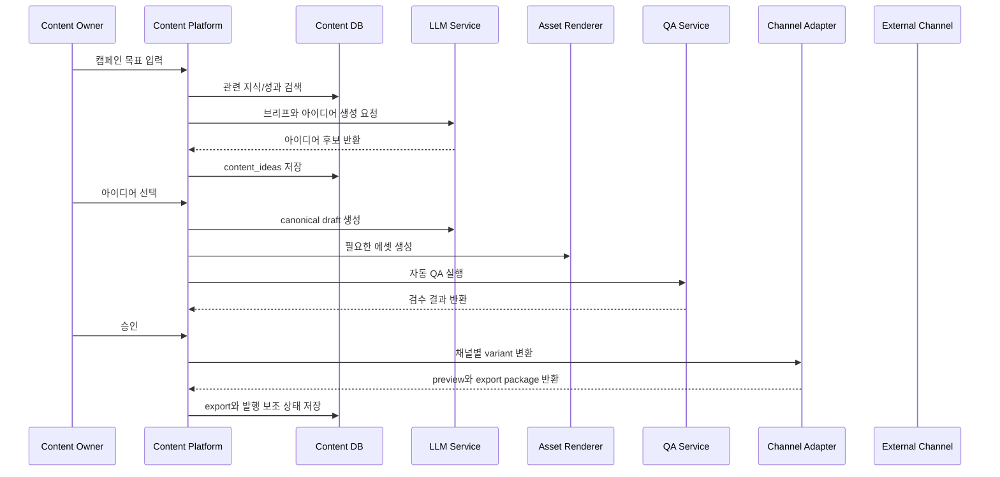

# Local-First Content Generation Workflow Design

## 1. Objective

이 설계는 로컬 PC에서 동작하는 범용 콘텐츠 생성 워크플로를 정의한다. 목표는 자료 수집, 지식화, 아이디어 발굴, 초안 생성, 멀티 포맷 에셋 제작, 검수, 채널별 변환, 내보내기/발행 보조, 성과 학습을 하나의 반복 가능한 시스템으로 연결하는 것이다.

대상 채널:

- Social: Instagram, TikTok, YouTube Shorts, X, LinkedIn, Facebook
- Owned Media: 블로그, 뉴스레터, 웹사이트, 앱 배너
- Paid Media: 검색 광고, 디스플레이 광고, 소셜 광고
- Sales/CRM: 세일즈 이메일, 랜딩 페이지, 메시지 캠페인
- Internal: 사내 공지, 교육 콘텐츠, 리포트

핵심 원칙:

- 기본 실행 환경은 단일 로컬 PC다.
- 로컬 파일시스템과 로컬 DB를 우선 사용한다.
- 외부 API 연동은 선택 사항이며, API가 없으면 파일 내보내기와 수동 발행 큐로 처리한다.
- 원본 콘텐츠와 채널별 변형물을 분리한다.
- 모든 생성물은 출처, 프롬프트, 모델, 버전, 승인 이력을 남긴다.
- 채널별 제약은 어댑터 계층에서 처리한다.
- 자동 생성 후 사람 검수 또는 정책 기반 자동 승인 단계를 둔다.
- 성과 데이터는 다음 기획, 생성, 랭킹에 다시 반영한다.

## 2. Local Runtime Architecture

로컬 PC에서는 복잡한 분산 시스템보다 단순하고 복구 가능한 구성이 적합하다.

권장 실행 형태:

- Desktop/Web UI: 로컬 브라우저에서 `http://localhost`로 접근
- App Server: Node.js 또는 Python 기반 로컬 서버
- Local DB: SQLite 우선, 필요 시 PostgreSQL + pgvector
- Local Files: `data/` 디렉터리에 원본, 생성물, preview, export 저장
- Worker: 같은 PC에서 실행되는 백그라운드 작업 프로세스
- Scheduler: 앱 내 cron 또는 OS 스케줄러
- LLM: 클라우드 API 또는 로컬 LLM 중 선택
- Renderer: Playwright/Canvas/FFmpeg 기반 로컬 렌더링

권장 디렉터리:

```text
content-maker/
  data/
    raw/
    knowledge/
    assets/
    previews/
    exports/
    metrics/
    logs/
  db/
    content-maker.sqlite
  prompts/
  templates/
  adapters/
```

## 3. High-Level Architecture

```mermaid
flowchart LR
  A[Source Collection] --> B[Raw Knowledge Lake]
  B --> C[Normalize & Enrich]
  C --> D[Content Intelligence Store]
  D --> E[Content Strategy & Brief]
  E --> F[Idea Generation]
  F --> G[Canonical Draft Generation]
  G --> H[Asset & Variant Generation]
  H --> I[Policy, Brand & Quality QA]
  I --> J[Human Review]
  J --> K[Channel Adaptation]
  K --> L[Export, Schedule & Publish Assist]
  L --> M[Performance Collection]
  M --> N[Analytics & Learning]
  N --> D
```



## 4. Workflow Concepts

### 4.1 Canonical Content

Canonical content는 플랫폼에 올리기 전의 원본 콘텐츠 단위다. 하나의 canonical content에서 여러 채널 변형물이 생성된다.

예시:

- 하나의 제품 출시 브리프
- 하나의 블로그 초안
- 하나의 캠페인 메시지
- 하나의 교육 콘텐츠 스크립트
- 하나의 고객 사례 스토리

Canonical content에는 다음 정보가 포함된다.

- 목표: awareness, conversion, retention, education 등
- 타깃 오디언스
- 핵심 메시지
- 증거 자료와 출처
- 톤앤매너
- 금지 표현
- CTA
- 사용 가능한 에셋
- 법무/브랜드 제약

### 4.2 Channel Variant

Channel variant는 canonical content를 특정 채널과 포맷에 맞춘 결과물이다.

예시:

- Instagram carousel
- TikTok short video script
- LinkedIn post
- Blog article
- Newsletter section
- Google Ads headline/description
- Landing page hero copy
- In-app push message

각 variant는 채널별 제약을 가진다.

- 글자 수
- 이미지/영상 비율
- 파일 크기
- 해시태그/링크 제한
- CTA 형식
- 정책 위반 가능성
- 승인 워크플로
- 발행 API 요구사항

## 5. Pipeline Stages

### 5.1 Source Collection

수집 대상:

- 외부 트렌드: 소셜, 뉴스, 검색 트렌드, 커뮤니티, 경쟁사 콘텐츠
- 내부 지식: 제품 문서, 브랜드 가이드, FAQ, 고객 사례, 세일즈 자료
- 캠페인 데이터: 목표, 기간, 예산, 타깃, 오퍼
- 기존 콘텐츠: 과거 발행물, 초안, 이미지, 영상, 랜딩 페이지
- 성과 데이터: 조회, 클릭, 전환, 저장, 공유, 댓글, 매출 기여

수집 방식:

- 로컬 파일 업로드: CSV, PDF, Markdown, DOCX, PPTX, 이미지, 영상
- 폴더 감시: `data/raw/inbox`에 파일을 넣으면 자동 수집
- 클립보드/URL/텍스트 수동 입력
- 공식 API: 선택 사항
- CMS/CRM/Analytics 연동: 선택 사항
- 허용된 범위의 로컬 크롤러

원칙:

- 원본 데이터는 수정하지 않고 `raw_sources`에 저장한다.
- 개인정보와 민감 정보는 수집 직후 마스킹하거나 접근 권한을 제한한다.
- 출처 URL, 수집 시각, 라이선스, 사용 가능 범위를 함께 기록한다.

### 5.2 Normalize & Enrich

처리 작업:

- 텍스트 추출
- 중복 제거
- 언어 감지
- 개인정보/민감정보 탐지
- 키워드, 엔티티, 주제, 감정 추출
- 콘텐츠 타입 분류
- 이미지/영상 메타데이터 추출
- 임베딩 생성
- 출처 신뢰도와 최신성 점수 계산

출력:

- `knowledge_items`
- `audience_signals`
- `topic_signals`
- `reference_assets`
- `content_performance_features`

### 5.3 Content Intelligence Store

콘텐츠 생성에 필요한 맥락을 검색 가능한 형태로 저장한다.

권장 저장소:

- SQLite: 캠페인, 콘텐츠, 워크플로 상태, 승인 이력
- 로컬 파일시스템: 원본 파일, 이미지, 영상, 렌더링 결과
- SQLite FTS 또는 로컬 벡터 인덱스: 브랜드 문서, 과거 콘텐츠, 트렌드, 고객 인사이트 검색
- DB 기반 job queue: 비동기 작업, 중복 실행 방지, 재시도 관리
- CSV/SQLite 분석 테이블: 성과 데이터, 집계 지표, 실험 결과

PostgreSQL, Redis, S3 호환 저장소는 여러 사용자나 서버 운영이 필요해진 뒤의 확장 옵션으로 둔다.

### 5.4 Strategy & Brief Generation

브리프는 콘텐츠 생성의 계약서 역할을 한다. 자동 생성할 수 있지만, 고위험 캠페인에서는 사람이 승인한다.

브리프 구성:

- 캠페인 목표
- 대상 고객
- 고객 문제와 욕구
- 핵심 메시지
- 지원 근거
- 채널 후보
- 포맷 후보
- CTA
- 브랜드 톤
- 금지 표현
- 성공 지표

브리프 품질 기준:

- 목표와 CTA가 일치해야 한다.
- 근거가 없는 과장 표현을 만들지 않아야 한다.
- 채널별 재사용이 가능할 만큼 추상화되어야 한다.

### 5.5 Idea Generation

입력:

- 승인된 브리프
- 최근 트렌드
- 브랜드/제품 지식
- 과거 성과 상위 콘텐츠
- 채널별 콘텐츠 캘린더

생성 결과:

- 콘텐츠 아이디어
- 예상 타깃
- 추천 채널
- 추천 포맷
- 훅 또는 제목
- 핵심 메시지
- CTA
- 참고 자료
- 예상 리스크

랭킹 기준:

- 캠페인 목표 적합도
- 브랜드 적합도
- 차별성
- 과거 성과 유사 패턴
- 제작 난이도
- 정책/법무 리스크

### 5.6 Canonical Draft Generation

플랫폼에 묶이지 않은 원본 초안을 먼저 만든다.

산출물:

- long-form article draft
- short-form message draft
- campaign master copy
- video/storyboard script
- email narrative
- FAQ/education content
- creative direction

생성 시 저장해야 할 메타데이터:

- 사용한 지식 항목
- 프롬프트 버전
- 모델 버전
- 생성 파라미터
- 생성 시각
- 초안 버전
- 자동 평가 점수

### 5.7 Asset & Variant Generation

Canonical draft를 기반으로 필요한 에셋과 채널 변형물을 만든다.

텍스트 변형:

- 제목
- 본문
- 요약
- 캡션
- 광고 카피
- 이메일 제목/프리헤더
- CTA
- 자막
- 대체 텍스트

비주얼/미디어 변형:

- 썸네일
- 소셜 이미지
- 캐러셀 슬라이드
- 랜딩 페이지 이미지
- 짧은 영상 스토리보드
- 영상 자막 파일
- 광고 배너

구현 방식:

- 텍스트는 LLM 기반 생성 및 편집
- 이미지는 템플릿 렌더러, 디자인 시스템, 이미지 생성 모델을 조합
- 영상은 장면 단위 스토리보드와 렌더링 파이프라인으로 생성
- 브랜드 로고, 색상, 폰트, 여백 규칙은 템플릿에서 강제

### 5.8 QA & Review

자동 QA:

- 사실성 검증
- 출처 누락 탐지
- 금칙어/민감 표현 탐지
- 과장 광고 탐지
- 브랜드 톤 위반 탐지
- 문법/맞춤법 검사
- 이미지 내 텍스트 오버플로 검사
- 접근성 검사: alt text, 대비, 자막
- 저작권/라이선스 위험 검사
- 채널 정책 위반 가능성 검사

사람 검수:

- 승인
- 수정 요청
- 조건부 승인
- 폐기
- 법무/브랜드팀 에스컬레이션

검수 결과는 다음 생성 프롬프트와 평가 모델에 반영한다.

### 5.9 Channel Adaptation

채널 어댑터는 공통 콘텐츠를 각 플랫폼의 제약에 맞게 변환한다.

어댑터 책임:

- 글자 수 조정
- 이미지/영상 비율 변환
- 링크/UTM 삽입
- 해시태그/키워드 최적화
- 채널별 CTA 변환
- 메타데이터 매핑
- 발행 API payload 생성
- preview 생성
- 정책 validation

예시 어댑터:

- `instagram_adapter`
- `tiktok_adapter`
- `youtube_shorts_adapter`
- `linkedin_adapter`
- `blog_cms_adapter`
- `newsletter_adapter`
- `ads_adapter`
- `landing_page_adapter`
- `push_notification_adapter`

### 5.10 Export, Scheduling & Publish Assist

발행 정책:

- 채널별 발행 가능 시간대
- 캠페인 캘린더 중복 방지
- 동일 주제 반복 제한
- 계정/채널별 rate limit
- 승인되지 않은 variant 발행 차단
- 실패 시 재시도와 수동 처리 큐

로컬 PC 기준 처리 방식:

- 채널별 업로드 패키지 생성: 이미지/영상/본문/해시태그/메타데이터
- CMS draft 파일 생성: Markdown, HTML, JSON
- 광고 플랫폼 업로드용 CSV 생성
- 이메일 캠페인용 HTML/텍스트 파일 생성
- 수동 발행 체크리스트 생성
- API 직접 발행: 선택 사항

### 5.11 Performance Feedback Loop

수집 지표:

- 노출
- 조회
- 도달
- 클릭
- 전환
- 좋아요/반응
- 댓글
- 저장
- 공유
- 구독/팔로우
- 매출 기여
- 영상 시청 유지율
- 이메일 오픈/클릭/해지
- SEO 순위/검색 유입

분석 결과:

- 주제별 성과
- 오디언스별 성과
- 채널별 성과
- 포맷별 성과
- 훅/제목 유형별 성과
- CTA 유형별 성과
- 업로드 시간대별 성과
- 모델/프롬프트 버전별 성과

이 결과는 다음 단계에 사용한다.

- 아이디어 랭킹
- 채널 추천
- 포맷 추천
- 카피 스타일 조정
- 발행 시간 최적화
- 프롬프트 개선

## 6. Core Data Model

```sql
create table raw_sources (
  id uuid primary key,
  source_type text not null,
  source_url text,
  license_scope text,
  collected_at timestamptz not null,
  raw_payload jsonb not null,
  content_hash text not null unique
);

create table knowledge_items (
  id uuid primary key,
  raw_source_id uuid references raw_sources(id),
  title text,
  body text,
  language text,
  content_type text not null,
  entities jsonb not null default '[]',
  keywords text[],
  topics text[],
  trust_score numeric not null default 0,
  freshness_score numeric not null default 0,
  embedding_id text,
  created_at timestamptz not null
);

create table campaigns (
  id uuid primary key,
  name text not null,
  objective text not null,
  target_audience jsonb not null default '{}',
  start_at timestamptz,
  end_at timestamptz,
  status text not null,
  created_at timestamptz not null
);

create table content_briefs (
  id uuid primary key,
  campaign_id uuid references campaigns(id),
  goal text not null,
  audience text not null,
  key_message text not null,
  evidence jsonb not null default '[]',
  tone text,
  constraints jsonb not null default '{}',
  success_metrics text[],
  status text not null,
  created_at timestamptz not null
);

create table content_ideas (
  id uuid primary key,
  brief_id uuid references content_briefs(id),
  title text not null,
  summary text not null,
  target_persona text,
  recommended_channels text[],
  recommended_formats text[],
  hook text,
  cta text,
  rationale text,
  risk_notes text,
  score numeric not null default 0,
  status text not null,
  generated_by text not null,
  prompt_version text not null,
  created_at timestamptz not null
);

create table canonical_contents (
  id uuid primary key,
  idea_id uuid references content_ideas(id),
  content_type text not null,
  title text,
  body jsonb not null,
  source_refs jsonb not null default '[]',
  status text not null,
  version int not null default 1,
  generated_by text not null,
  prompt_version text not null,
  model_version text,
  created_at timestamptz not null
);

create table content_variants (
  id uuid primary key,
  canonical_content_id uuid references canonical_contents(id),
  channel text not null,
  format text not null,
  payload jsonb not null,
  constraints jsonb not null default '{}',
  status text not null,
  version int not null default 1,
  created_at timestamptz not null
);

create table assets (
  id uuid primary key,
  variant_id uuid references content_variants(id),
  asset_type text not null,
  file_path text not null,
  metadata jsonb not null default '{}',
  license_scope text,
  status text not null,
  created_at timestamptz not null
);

create table qa_results (
  id uuid primary key,
  target_type text not null,
  target_id uuid not null,
  qa_type text not null,
  status text not null,
  score numeric,
  findings jsonb not null default '[]',
  created_at timestamptz not null
);

create table review_tasks (
  id uuid primary key,
  target_type text not null,
  target_id uuid not null,
  reviewer_id uuid,
  status text not null,
  feedback text,
  reviewed_at timestamptz,
  created_at timestamptz not null
);

create table channel_accounts (
  id uuid primary key,
  channel text not null,
  account_ref text not null,
  display_name text,
  auth_file_path text,
  status text not null,
  created_at timestamptz not null
);

create table scheduled_publications (
  id uuid primary key,
  variant_id uuid references content_variants(id),
  channel_account_id uuid references channel_accounts(id),
  scheduled_at timestamptz not null,
  published_at timestamptz,
  external_content_id text,
  status text not null,
  error_message text,
  created_at timestamptz not null
);

create table performance_metrics (
  id uuid primary key,
  publication_id uuid references scheduled_publications(id),
  metric_name text not null,
  metric_value numeric not null,
  measured_at timestamptz not null,
  dimensions jsonb not null default '{}'
);
```

## 7. Orchestration

권장 구조:

- MVP는 앱 서버 안의 로컬 job queue와 worker로 관리
- 정기 작업은 앱 내 scheduler 또는 OS cron/launchd로 실행
- 복잡해진 뒤 Dagster 또는 Prefect를 로컬 모드로 도입
- 실시간 생성/렌더링은 로컬 worker로 분리
- 장시간 실행되는 생성 작업은 job 상태를 DB에 기록
- 모든 단계는 idempotent하게 설계
- 채널 발행은 실패 격리를 위해 어댑터별 worker로 분리

주요 DAG/Job:

- `collect_sources`
- `normalize_and_enrich_sources`
- `generate_content_briefs`
- `generate_content_ideas`
- `generate_canonical_drafts`
- `generate_channel_variants`
- `run_quality_checks`
- `create_review_tasks`
- `adapt_channel_payloads`
- `export_scheduled_content`
- `publish_scheduled_content`: API 연동을 켠 경우에만 사용
- `collect_performance_metrics`
- `update_learning_features`

## 8. End-to-End Workflow



## 9. Quality Gates

발행 전 필수 통과 조건:

- canonical content가 승인 상태여야 한다.
- target channel variant가 승인 상태여야 한다.
- 자동 QA 결과가 `pass` 또는 승인된 `override`여야 한다.
- 필수 출처가 누락되지 않아야 한다.
- 저작권/라이선스 범위가 발행 채널과 맞아야 한다.
- 채널별 글자 수, 파일 크기, 비율, API validation을 통과해야 한다.
- 예약 시간이 캠페인 캘린더와 충돌하지 않아야 한다.

## 10. Channel Adapter Contract

모든 채널 어댑터는 같은 인터페이스를 구현한다.

```ts
type ChannelAdapter = {
  channel: string;
  validate(input: CanonicalContent, constraints: ChannelConstraints): ValidationResult;
  transform(input: CanonicalContent, target: ChannelTarget): ContentVariant;
  preview(variant: ContentVariant): PreviewArtifact;
  exportPackage(variant: ContentVariant, account: ChannelAccount): ExportResult;
  publish?(variant: ContentVariant, account: ChannelAccount): PublishResult;
  collectMetrics(publication: PublicationRef): PerformanceMetric[];
};
```

어댑터 예시:

- Blog adapter: 제목, slug, SEO description, 본문 HTML/Markdown, OG image 생성
- Newsletter adapter: subject, preheader, body, segment, send time 생성
- Social adapter: caption, media, hashtags, mention, aspect ratio 처리
- Ads adapter: headline, description, creative, UTM, campaign/ad group mapping 처리
- Push adapter: title, body, deeplink, segment, frequency cap 처리

## 11. Observability

로그:

- source 수집량
- enrichment 실패율
- 생성 요청/응답 latency
- 모델별 실패율
- QA 실패 사유
- 채널 어댑터 validation 실패 사유
- 발행 성공/실패 사유

메트릭:

- 브리프 대비 아이디어 생성 수
- 아이디어 승인율
- 초안 생성 대비 승인율
- variant 생성 대비 발행율
- 채널별 발행 실패율
- 콘텐츠 포맷별 engagement rate
- 모델/프롬프트 버전별 성과
- 콘텐츠 1건당 평균 제작 시간

알림:

- 수집 실패
- 생성 실패율 급증
- QA 실패율 급증
- 발행 실패
- 채널 API rate limit 근접
- 성과 데이터 수집 지연

## 12. Security & Compliance

- 채널 API 토큰은 `.env.local` 또는 OS keychain에 저장하고 Git에 포함하지 않는다.
- 로컬 단일 사용자 실행을 기본으로 하되, 여러 사용자가 쓰는 경우 캠페인/채널/계정 접근 권한을 분리한다.
- 원본 데이터와 생성물의 출처를 추적한다.
- 개인정보 포함 가능 데이터는 마스킹하거나 접근 제어한다.
- 저작권 위험이 있는 외부 이미지는 직접 재사용하지 않는다.
- 광고/의료/금융/법률 등 고위험 도메인은 별도 승인 게이트를 둔다.
- 모든 승인, 수정, 발행 이벤트는 감사 로그로 보관한다.

## 13. Recommended MVP Scope

1. 브랜드/제품/고객 자료 수동 업로드
2. 캠페인 브리프 생성
3. 콘텐츠 아이디어 후보 생성
4. canonical draft 생성
5. 2개 채널 variant 생성: 예를 들어 블로그와 Instagram
6. 기본 자동 QA
7. 사람 검수 큐
8. 로컬 export package 생성 또는 CMS draft 파일 생성
9. 성과 데이터 CSV 업로드
10. 성과 기반 다음 아이디어 추천

MVP 이후 확장:

- 채널 API 직접 발행
- 자동 트렌드 수집
- 이미지/영상 렌더링 자동화
- A/B 테스트
- 채널별 최적 발행 시간 추천
- 프롬프트/모델 버전별 성과 최적화
- 법무/브랜드 승인 워크플로 고도화

## 14. Suggested Tech Stack

소규모 MVP:

- Next.js 또는 Remix: 운영 UI
- SQLite: 콘텐츠 메타데이터, 워크플로 상태, 성과 데이터
- SQLite FTS 또는 LanceDB/Chroma 로컬 인덱스: 문서 검색과 임베딩 검색
- 로컬 파일시스템: 원본 파일, 에셋, preview, export 저장
- DB 기반 job queue 또는 BullMQ local mode: 비동기 작업 큐
- OpenAI API 또는 호환 LLM: 텍스트 생성/분류/평가
- Ollama/LM Studio: 로컬 LLM 선택지
- Playwright, HTML Canvas, FFmpeg: 이미지/문서/영상 preview 렌더링

로컬 고급 구성:

- PostgreSQL + pgvector: 데이터가 커지거나 동시 작업이 필요할 때
- Dagster 또는 Prefect: 복잡한 로컬 워크플로 오케스트레이션
- DuckDB: 로컬 분석과 리포트
- Metabase local: 성과 대시보드
- OS keychain: 채널 토큰과 API key 관리

## 15. Implementation Milestones

### Phase 1: Foundation

- DB 스키마 구축
- source upload와 knowledge item 생성
- 캠페인/브리프 입력 UI
- 기본 아이디어 생성

### Phase 2: Generation

- canonical draft 생성
- channel variant 생성
- 텍스트 QA
- 검수 큐

### Phase 3: Asset & Adapter

- 템플릿 기반 이미지 생성
- preview renderer
- 채널 어댑터 2-3개 구현
- 채널별 validation

### Phase 4: Export & Publishing Assist

- 예약 캘린더
- CMS draft 파일 또는 소셜 업로드 패키지 생성
- 발행 보조 상태 추적
- 실패 재시도와 수동 처리 큐

### Phase 5: Learning Loop

- 성과 데이터 수집
- 성과 대시보드
- 아이디어 랭킹 개선
- 프롬프트 버전별 성과 분석
