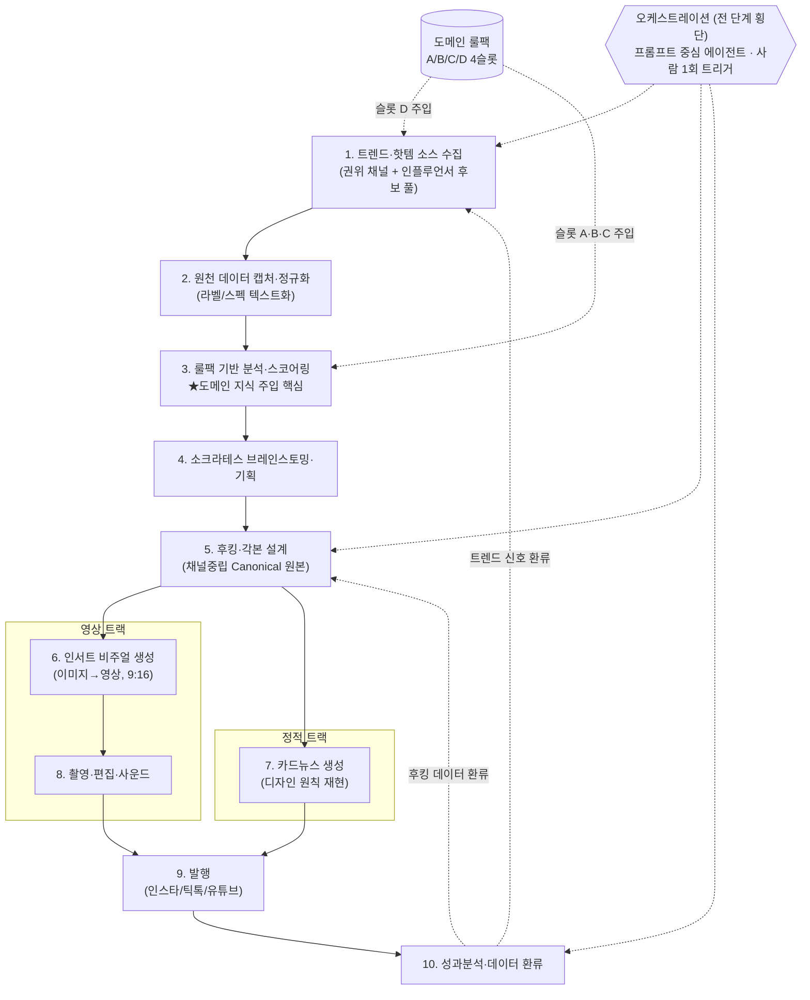
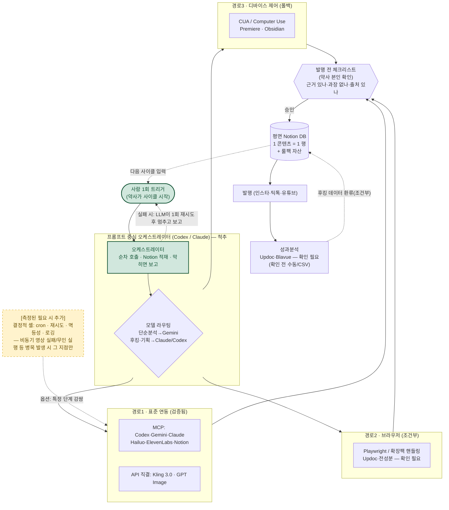

# 범용 SNS 콘텐츠 제작 오케스트레이션 워크플로우 제안

> 본 제안서는 1인 크리에이터(약사)의 실제 콘텐츠 제작 워크플로우를 다룬 회의 내용을 근거로 백지에서 작성되었다. 회의에서 확인된 사실, 미확인으로 남은 열린 항목, 그리고 회의 후 가용성 점검에서 1차 출처로 확인하거나 확인하지 못한 사항을 구분해 기술한다. **설계 원칙 하나를 먼저 못 박는다 — 추측된 툴 가용성 위에 아키텍처를 세우지 않는다.** 가용성이 1차 출처로 확인된 툴만 자동 연동 경로에 배치하고, 미확인 툴은 "확인 필요"로 명시한 뒤 경로를 조건부로만 제시한다.

---

## 1. 요약 (Executive Summary)

- **척추는 오케스트레이션이다.** 회의가 단일 최우선 과제로 지목한 것은 "여러 AI 툴을 사람이 매번 직접 열고 결과물을 옮기는 수동 전환"의 제거다. 이 제안의 1차 권고는 **프롬프트 중심 오케스트레이터 에이전트(Codex/Claude)가 검증된 MCP/API 툴들을 자연어로 순차 호출하는 방식**이며, 1인 비개발 운영자가 코드 재배선 없이 직접 유지할 수 있는 가장 가벼운 형태로 시작한다.
- **범용화의 핵심은 도메인 룰팩이다.** 워크플로 10단계와 단계 간 입출력 계약은 고정하고, 규제 기준·업계 암묵지·스코어링 루브릭·수집 소스를 담은 "룰팩"만 교체하면 화장품 워크플로가 식품·건기식·패션·전자·금융으로 그대로 전환된다.
- **하이브리드를 권고하되 경계선을 명확히 한다.** 프롬프트 두뇌는 "무엇을·어느 모델로·얼마나 좋은지"를, 얇은 결정적 계층은 "언제·다시·멈출지"를 책임진다. 단 1인 운영 시작 시점에서 결정적 계층은 **거의 비어 있는 상태**로 두고, 실제 병목이 측정된 그 지점에만 최소한으로 덧붙인다.
- **미검증 도구는 사실처럼 단정하지 않는다.** 회의에서 거론된 OpenFlow·Hermes는 제품 동일성이 확정되지 않았고, Updoc·Blavue·Clova Note는 공식 API/MCP를 확인하지 못했다. 이들은 모두 "확인 필요"로 게이트하고, 검증 전 채택을 권고하지 않는다.
- **과설계를 경계한다.** 1인 운영자에게 무인 24/7 운영·관계형 데이터 웨어하우스·상태 머신은 시작 단계에서 부담만 키운다. 본 제안은 검증된 코어로 동작하는 가벼운 기본형(MVP)을 먼저 확정하고, 무거운 장치는 "필요가 측정되면 추가하는 옵션"으로 명시 강등한다.

---

## 2. 배경 & 현황 진단

### 2.1 크리에이터 프로파일

회의에서 시연된 워크플로우의 주체는 **1인 운영 크리에이터(약사)**다. 전성분 스크린샷 캡처 → AI 입력 → 평가 → 기획·각본·영상·카드뉴스 제작에 이르는 전 파이프라인을 본인이 직접 수행한다. 개발팀은 제작 주체가 아니라 자동화 가능성을 자문하는 별도 협업 주체로만 등장한다.

기술 숙련도는 **높은 AI 툴 활용 능력을 가진 비개발자**로 판단된다.

- 근거 1: Codex·Gemini·Claude·Hailuo·Kling·Sora·ElevenLabs·Notion·Obsidian 등 다수 생성형/분석 툴을 목적별로 분리 운용한다.
- 근거 2: 식약처 고시 함량 기준과 "1% 기준선" 같은 업계 내부 지식을 프롬프트에 직접 반영해 AI 단독으로는 어려운 정확도를 확보한다(높은 프롬프트 엔지니어링 역량).
- 근거 3: "소크라테스 모드"를 Claude/Codex 지침으로 입력해 브레인스토밍에 활용한다.
- 단, 코딩이 아니라 프롬프트 중심으로 워크플로우를 구성하고 자동화 구현은 개발팀에 의존한다. 개발팀이 "코딩 기반 스케줄러보다 프롬프트 중심 AI 모델 조합이 지속 관리에 적합"하다고 본 이유도 이 비개발자 1인 운영 특성과 맞물린다.

**이 프로파일이 설계 전반을 규정한다.** 유지보수 주체가 비개발 1인이므로, 깨졌을 때 직접 못 고치는 무거운 장치는 도입 자체가 리스크다.

### 2.2 페인포인트

| ID | 페인포인트 | 심각도 | 근거 |
|---|---|---|---|
| **PP-1** | Updoc·Hailuo·Kling 등 다수 AI 툴을 단계마다 사람이 직접 열고 결과물을 옮기며 수동 전환해야 함. 자동화를 최우선으로 끌어올린 핵심 동인 | high | "다수 툴을 수동 전환 → 에이전트 간 오케스트레이션 자동화가 최우선 과제" |
| **PP-2** | SNS 페이지 스크린샷 분석에 쓰던 Claude 크롬 확장팩이 유료 플랜에서 반복 리로드 버그로 사용 중단. SNS 분석·카드뉴스 디자인 수집의 한 축이 막힘 | medium | "유료 플랜 반복 리로드, 베타 버그 추정으로 사용 중단" |
| **PP-3** | Claude/Codex 토큰 소모가 빨라 비용·한도 부담. 단순 분석은 더 저렴한 Gemini로 처리하고 싶음 | medium | "단순 분석은 Gemini 토큰 우선 사용 방안 문의" |
| **PP-4** | 성분 품질 평가에서 AI 단독 정확도가 부족해, 규제 기준·암묵지를 매번 사람이 프롬프트에 넣어야 정확도 확보 | medium | "1% 기준선 등 업계 내부 지식을 직접 반영해야 AI 단독으로 어려운 정확도 확보" |
| **PP-5** | 과거 기획 시 링크 요약 후 수동 검증이 번거로웠음(현재는 AI 자동 탐색·정리로 일부 개선) | low | "과거 링크요약+수동검증 → 현재 AI 자동 탐색·정리로 발전" |

핵심: **PP-1이 지목한 진짜 문제는 "제작 중 다수 툴을 사람이 옮겨 붙이는 핸드오프"이지 "무인 24/7 운영"이 아니다.** 이 구분은 5장 오케스트레이션 설계의 무게를 결정한다.

### 2.3 요구사항

| ID | 요구사항 | 우선순위 |
|---|---|---|
| REQ-1 | 에이전트 간 오케스트레이션 자동화(수동 전환 제거) | P0 |
| REQ-2 | 주제탐색 → 각본 → 이미지 생성 → 영상화 파이프라인 자동화 설계 | P1 |
| REQ-3 | 표준 연동(MCP/API) / 브라우저 핸들링 / 디바이스 직접 제어 중 최적 경로 결정(툴이 API·MCP 제공 시 표준 경로 성립) | P1 |
| REQ-4 | 자동 추출 스크립트·후킹 데이터를 Notion에서 바로 활용 가능한 형태로 가공(가독성 개선) | P1 |
| REQ-5 | 개발팀이 구축 중인 콘텐츠 성과 대시보드 공유·연동 | P1 |
| REQ-6 | 단순 분석은 Gemini 토큰 우선 라우팅으로 비용 절감 | P2 |
| REQ-7 | Claude 크롬 확장팩 리로드 버그에 데스크탑 앱 대안 검토·적용 | P2 |

### 2.4 핵심 긴장(본 제안이 입장을 내야 할 지점)

- **긴장 A — 코드 스케줄러 vs 프롬프트 중심 조합.** 개발팀은 지속 관리 측면에서 프롬프트 중심을 선호. 비개발 1인 운영 특성과 맞물린다. → 5장에서 하이브리드 입장으로 해소.
- **긴장 B — 표준 인터페이스(MCP/API) vs 비표준 제어(브라우저/디바이스).** 툴이 API/MCP를 제공해야 표준 경로가 성립한다는 제약. → 5장 3경로 계층 결정으로 해소.

---

## 3. 범용 워크플로 프레임 + 툴 → 단계 매핑

특정 버티컬(화장품)에서 출발했으나, 단계 흐름과 단계 간 입출력 계약은 버티컬과 무관하게 고정하고 도메인 지식만 교체 가능하도록 일반화한다.

### 3.1 일반화된 10단계 흐름



**단계 설명**

1. **트렌드·핫템 소스 수집** — 버티컬별 권위 채널(화장품=올리브영·약국·아모레·LG·프란츠)과 인플루언서 추천 제품에서 화제 아이템을 수집해 후보 풀 구성. "과거 링크요약+수동검증 → AI 자동 탐색"의 발전을 계승.
2. **원천 데이터 캡처·정규화** — 핵심 사실 데이터(화장품=전성분 라벨)를 스크린샷/텍스트로 캡처해 일관 형식으로 정규화. 룰팩이 깨끗한 입력에 적용되도록 만드는 다리 단계.
3. **룰팩 기반 분석·스코어링** ★ — 정규화 데이터를 룰팩(규제 기준+내부 휴리스틱+스코어링 루브릭)으로 평가해 AI 단독으로는 못 내는 정확도의 점수·순위 산출. 버티컬 교체 시 단계는 고정, 주입 내용만 교체.
4. **소크라테스 브레인스토밍·기획** — 랭킹과 트렌드를 재료로 AI가 연속 질문을 던져 목표·앵글·타깃을 구체화.
5. **후킹·각본 설계(Canonical 원본)** — 기획안을 후킹 문구 + 키워드 중심 구술 각본으로 전개. 후킹은 Claude(품질 우수), 본문 구성은 Codex. 이 산출물이 채널중립 원본(3.4).
6. **인서트 비주얼 생성** — 인서트샷을 이미지 생성 → 영상화 → 후처리의 다단 파이프라인으로 제작(9:16). PP-1이 지목한 수동 전환 구간의 핵심.
7. **카드뉴스 생성** — 참고 계정 디자인 원칙(색상 비율 6:3:1 등)을 수집·정리해 프롬프트로 재현. 영상과 병렬.
8. **촬영·편집·사운드** — 구술 촬영 원본 + 인서트 클립 + 음성/효과음(ElevenLabs)을 Premiere로 편집·조립.
9. **발행** — 인스타/틱톡/유튜브 배포. 성과분석 입력 생성.
10. **성과분석·데이터 환류** — 참여율/조회수/좋아요/댓글/게시빈도를 측정하고 잘 먹힌 후킹 데이터를 Notion 활용 형태로 가공해 5단계·1단계로 환류. 닫힌 루프 완성.

### 3.2 단계별 툴 매핑 표

회의에 등장한 툴만 사용한다. 통합 경로는 5장 가용성 매트릭스를 따른다. **미확인 가용성은 비고에 명시한다.**

| 단계 | 권장 툴 | 통합 경로 | 비고 |
|---|---|---|---|
| 1. 트렌드·핫템 수집 | Codex(주력), Claude 데스크탑 앱, Notion(저장) | 경로1 (MCP) | 크롬 확장팩은 리로드 버그로 사용 중단 → 데스크탑 앱 전환 권고(REQ-7) |
| 2. 캡처·정규화 | 스크린샷 → Gemini(단순 분석 보조) | 경로1 (MCP) | "단순 분석은 Gemini 우선" 라우팅 **구현법 미확인(열린 항목)** |
| 3. 룰팩 분석·스코어링 | Codex(주력)+Gemini(보조), Notion(저장) | 경로1 (MCP) | 룰팩을 시스템/컨텍스트로 주입(4장) |
| 4. 소크라테스 기획 | Codex 또는 Claude, Notion, Obsidian(임시) | 경로1 (MCP) / Obsidian=경로3 | Obsidian 공식 클라우드 API 없음, 로컬 플러그인 한정 |
| 5. 후킹·각본 | Claude(후킹)+Codex(각본 구성) | 경로1 (MCP) | — |
| 6. 인서트 비주얼 | GPT Image → Hailuo(영상화 9:16) → Kling 3.0(후처리) | GPT Image=API / Hailuo=MCP / Kling=API | **Hailuo=MiniMax 영상 엔진**(회의록 '힉스필드' 병기는 혼동 표기). Hailuo MCP는 공식 리포로 **확인됨**. **Sora 2.0은 배제**(아래 3.3). GPT Image: gpt-image-1 2026-10-23 일몰 예정 |
| 7. 카드뉴스 | Claude(디자인 원칙 6:3:1 수집) → 프롬프트 재현 | 경로1 (MCP) / 수집은 경로2 보조 | 확장팩 의존 작업은 데스크탑 앱·Playwright로 이전 |
| 8. 촬영·편집·사운드 | 구술 촬영, ElevenLabs(음성·효과음), Premiere Pro(편집) | ElevenLabs=MCP / Premiere=경로3 | Premiere 클라우드 API 없음 → UXP/로컬 데스크탑 |
| 9. 발행 | 인스타/틱톡/유튜브 게시 | **미규정** | 자동화 경로 회의 미규정 → 8장 열린 항목(약관·차단 리스크 동반) |
| 10. 성과분석·환류 | Updoc(크롬 확장), Blavue, Notion(환류 가공) | Updoc=경로2(조건부) / Blavue=**미확인** / Notion=MCP | **Updoc·Blavue 공식 API/MCP 미확인.** Blavue는 경로조차 미확인. 자동 환류는 조건부(확인 전 수동/CSV) |
| 횡단(STT) | Clova Note(회의 녹음 정리) | **미확인** | Clova Note 공개·셀프서브 API 미확인(NCP CLOVA Speech/Studio와 별개) |

### 3.3 Sora 2.0 — 미래 리스크가 아니라 '현재의 막다른 길'

오늘(2026-05-29) 기준 **Sora 컨슈머 앱은 이미 종료(2026-04-26)되었고, Videos API도 2026-09-24 종료가 공식 예고**되어 있다(약 4개월 잔여). 후속 영상 API 경로는 미공개. 따라서 Sora는 "장차 위험"이 아니라 **지금 채택하면 4개월 내 무력화되는 막다른 길**이다. **이미지→영상 자동화는 Kling 3.0(공식 API) / Hailuo(공식 MCP)를 1순위로 설계하고, Sora는 신규 의존에서 배제한다.**

### 3.4 Canonical(채널중립 원본) → 채널별 변형 분리

회의의 실제 흐름은 *각본을 한 번 만들고(5단계), 키워드만 암기해 구술 촬영하며(8단계), 별도로 9:16 인서트샷을 붙이고(6단계), 같은 메시지를 카드뉴스로 재현(7단계)*하는 구조다. 즉 **"무엇을 말할지(substance)"는 한 번 생산하고, "어느 채널에 어떻게 내보낼지(format)"는 채널마다 변형**한다.

- **Canonical = 4단계 기획안 + 3단계 핵심 메시지/스코어링 근거 + 5단계 후킹·각본.** 플랫폼 규격(9:16, 카드 매수, 길이)을 아직 포함하지 않는 콘텐츠의 실체. 한 번만 생산되어 모든 채널 변형의 단일 출처가 된다.
- **영상 변형(5→6→8):** Canonical 각본을 키워드만 암기해 구술 촬영. 채널 차이는 (a) 5단계 벤치마킹 반영 후킹·길이 조정, (b) 6단계 9:16 인서트 삽입, (c) 8단계 음성·편집 조립에서 발생.
- **정적 변형(5→7):** 같은 핵심 메시지를 카드뉴스 포맷으로 재현. 영상 트랙과 병렬.
- **왜 분리하는가:** substance를 한 번만 생산하므로 트렌드/룰팩이 바뀌면 Canonical만 갱신해도 전 채널이 일관되게 따라온다. 6·7·8단계는 "원본을 채널 규격에 맞추는 어댑터"일 뿐이라 새 채널 추가가 콘텐츠 재기획이 아니다. **두 직교축 — 세로축(버티컬=룰팩 교체)·가로축(채널=변형 어댑터)** — 이 독립적으로 확장된다. *단, 10단계 후킹 데이터의 5단계 환류는 성과 데이터원(Updoc/Blavue)이 미확인이므로 자동 환류는 조건부이며, 확인 전까지는 수동/CSV 입력으로 루프를 닫는다(6장 참조).*

---

## 4. 도메인 룰팩 패턴 (범용화의 핵심)

핵심 패턴은 *"식약처 고시 함량 기준 + 1% 기준선 같은 업계 내부 지식을 AI 프롬프트에 직접 주입해, AI 단독으로는 못 내는 정확도를 확보한다"*는 것이다. 이를 버티컬을 갈아끼울 수 있는 **플러그형 지식 모듈**로 1급화한다. 워크플로 단계(1~10)와 입출력 계약은 불변, **이 룰팩만 교체하면** 화장품 워크플로가 식품/건기식/패션/전자/금융 워크플로로 변신한다.

### 4.1 룰팩 구조 — 4개 고정 슬롯

모든 버티컬의 룰팩은 동일한 4슬롯을 채운다. 슬롯은 고정, 내용만 다르다.

- **(A) 규제·공식 기준 데이터** — 외부 권위가 정한 검증 가능한 수치/기준. 신뢰도의 근간이므로 **출처가 명확한 1차 자료(고시·공식 기준)로만** 채운다.
- **(B) 내부 휴리스틱(업계 암묵지)** — 공식 문서엔 없지만 전문가가 아는 판독 규칙. 정확도를 좌우하는 핵심 슬롯이며 **전문가(약사) 검수 필수 — AI 자동 생성 시 정확도 보증 불가.**
- **(C) 스코어링 루브릭·가중치** — 아이템 순위를 매기는 자체 점수 기준.
- **(D) 수집 소스 채널 목록** — 후보 아이템을 긁어올 권위 채널 + 인플루언서.

### 4.2 룰팩 정의 예시 (YAML — 화장품 기준 사례)

```yaml
rulepack:
  vertical: cosmetics
  language: ko
  last_updated: "2026-05-29"        # 버전 추적은 '최종 수정일 + 변경 메모' 한 줄로 충분
  change_note: "나이아신아마이드 기준 갱신(식약처 고시 근거)"

  # (A) 규제·공식 기준 데이터 — 외부 권위, 검증 가능
  regulatory_baselines:
    source: "식약처 고시(기능성화장품 함량 기준)"
    actives:
      - ingredient: "나이아신아마이드"
        min_pct: 2.0
        max_pct: 5.0

  # (B) 내부 휴리스틱 — 업계 암묵지 (전문가 검수 필수)
  heuristics:
    - id: "one-percent-line"
      name: "1% 기준선"
      rule: >
        전성분 표기는 함량 많은 순. '1% 이하 성분'은 순서 무관 기재 허용 →
        표기 순서상 1% 기준선 위쪽 성분만 실질 함량 판단에 사용한다.
      requires_expert_review: true

  # (C) 스코어링 루브릭·가중치
  scoring:
    output_format: ["근거", "점수", "순위"]
    criteria:
      - key: "active_content"
        desc: "유효성분이 규제 함량 범위 충족 + 1% 기준선 위 위치"
        weight: 0.6
      - key: "ingredient_quality"
        desc: "전성분 구성 품질"
        weight: 0.4

  # (D) 수집 소스 채널 목록
  source_channels:
    authority: ["올리브영", "약국", "아모레", "LG", "프란츠"]
    influencer: ["뷰티 인플루언서 추천 제품"]
```

JSON이 필요한 곳(Notion 자산 저장, 오케스트레이터 바인딩)에서는 동일 스키마를 그대로 직렬화한다. 핵심은 **4슬롯 스키마가 고정**이라는 점이다.

> **운영 메모(과설계 방지):** 룰팩에 `{버티컬}-{슬롯}-{버전}` 같은 분리 버전 체계를 두지 않는다. 1인 비개발 운영자가 슬롯별 버전을 일관 유지하기는 어렵고, 안 지켜지면 추적 가치도 사라진다. **Notion 룰팩 페이지의 '최종 수정일' + 변경 메모 한 줄**로 충분하다(Notion이 페이지 히스토리를 자동 보관). 규제 데이터(A) 갱신만 'A슬롯 마지막 갱신: 날짜 + 근거 고시' 한 줄로 따로 남긴다.

### 4.3 분석·스코어링 프롬프트 주입 방식

- **시스템/컨텍스트 주입:** 분석 모델(Codex 주력, 단순 분석은 Gemini)의 시스템 프롬프트 또는 첨부 컨텍스트에 슬롯 (A)(B)(C)를 블록 단위로 주입. `[규제기준]`←(A), `[내부규칙]`←(B), `[스코어링]`←(C).
- **입력 분리:** 정규화된 사실 데이터(2단계 결과)는 룰팩과 분리해 전달. 모델 역할이 *"주어진 사실 데이터를, 주입된 룰팩 기준으로 평가하라"*로 명확히 갈린다.
- **출력 강제:** `평가 근거 + 점수 + 순위` 구조로 강제. 근거가 룰팩의 어느 슬롯·항목에서 나왔는지 추적 가능.
- **주입 지점:** 슬롯 (D)는 1단계, 슬롯 (A)(B)(C)는 3단계에 집중 주입. 후킹·각본 단계엔 룰팩 대신 성과 환류 데이터가 주입되고, (A)(B) 사실은 각본 정확성 검수 컨텍스트로 부차 참조.
- 룰팩은 코드가 아니라 **프롬프트/지식 자산**이므로 개발팀 판단(프롬프트 중심 선호)과 정확히 맞물린다.

### 4.4 버티컬 스왑 예시

워크플로 단계·입출력 계약은 불변, 교체 대상은 오직 4슬롯 내용. 새 버티컬 온보딩 = **새 4슬롯 채우기 + 1·3단계 주입 경로 연결**(단계 재설계 불필요).

| 버티컬 | (A) 규제 | (B) 휴리스틱 | (C) 스코어링 | (D) 소스 |
|---|---|---|---|---|
| **화장품**(기준) | 식약처 고시 함량(나이아신아마이드 2~5%) | '1% 기준선' | 유효성분 함량·순위 기반 점수 | 올리브영·약국·아모레·LG·프란츠 + 인플루언서 |
| **식품** | 식품표시기준·1일 영양성분 기준치(나트륨/당류), 원재료 함량 표시 | 원재료 함량순 → 첫 3개가 실질 정체성 / '무첨가' 실제 의미 | 영양밀도·첨가물 적을수록 가점 | 대형마트·편의점 신상·쿠팡 베스트·식품 인플루언서 |
| **건강기능식품** | 기능성원료 인정 목록·일일섭취량(비타민C 권장/상한) | 원료 형태별 흡수율 / 표시 함량 vs 실제 활성 / '함유' vs '주원료' | 기능성 인정 등급·함량 충족도 가중 | 약국·아이허브·홈쇼핑 핫템·건강 인플루언서 |
| **패션** | 섬유 혼용률 표시·KC 인증 라벨 규정 | 혼용률 순서·소재별 관리 난이도/내구성, 시즌 컬러·핏 | 소재 품질·가성비·트렌드 적합도 | 무신사·29CM·자라/유니클로 신상·패션 인플루언서 |
| **전자제품** | 에너지소비효율 등급·전자파/KC 적합성 표시 | 스펙시트 마케팅 수치(피크 vs 지속) 구분, 칩셋/패널 등급 | 핵심 스펙·실사용 성능·가성비 | 다나와·쿠팡·제조사 발표·테크 리뷰어 |
| **금융** | 금소법 광고 규정·필수 고지(원금 비보장·수수료·과거수익률≠미래보장) | 표면금리 vs 실효수익률, 우대조건 난이도, 총보수(TER) 숨은 비용 | 실효수익·비용·조건 충족·리스크 대비 가중 | 은행/증권사 신상품·핀테크 앱 랭킹·금융 인플루언서 |

> ※ 금융 등 규제 민감 버티컬은 **(A) 필수 고지 누락 검수 가중치를 최상위**로 둔다 — 룰팩 구조 자체는 동일하되, (C) 스코어링이 (A) 준수 여부를 차단 조건으로 처리한다.

---

## 5. 오케스트레이션 & 통합 레이어 (척추)

> 본 장은 제안서의 척추다. 1순위 과제(REQ-1, PP-1)를 어떤 연결 기판 위에, 어떤 제어 철학으로 세울지를 확정한다.

### 5.1 3가지 통합 경로 × 검증된 가용성 매핑

회의의 연동 선택지는 3종이다 — (a) 표준 프로그래매틱 연동, (b) 브라우저 플러그인·확장팩 핸들링, (c) 디바이스 직접 제어(클라우드/CUA). 회의의 명시적 제약은 "툴이 API 또는 MCP를 제공해야 (a) 가능"이다. 따라서 경로 1을 **표준 프로그래매틱 연동(MCP 우선 · 공식 MCP 미지원 시 REST API 직결)**으로 정의한다. 그렇지 않으면 API는 있으나 공식 MCP가 없는 툴(Kling·GPT Image)을 왜곡하게 된다.

| 툴 | 단계 | API | MCP | 권장 경로 | 검증 |
|---|---|---|---|---|---|
| **Codex** (OpenAI) | 기획·각본·분석 주력 | yes | yes | 경로1 · MCP (오케스트레이터 본체 후보) | 검증됨 |
| **Gemini** (Google) | 분석 보조, 토큰 절약 | yes | yes | 경로1 · MCP | 검증됨 |
| **Claude** (Anthropic) | 후킹·SNS분석·디자인 | yes | yes | 경로1 · MCP (오케스트레이터 본체 후보) | 검증됨 |
| **Hailuo / MiniMax** | 인서트 영상화(9:16) | yes | yes | 경로1 · MCP | 검증됨 ★아래 주 |
| **ElevenLabs** | 음성·효과음 | yes | yes | 경로1 · MCP | 검증됨 |
| **Notion** | 정리·룰팩 저장·환류 | yes | yes | 경로1 · MCP (공식 호스티드) | 검증됨 |
| **Kling 3.0** (Kuaishou) | 이미지→영상·후처리 | yes | 서드파티만 † | 경로1 · API 직결 | 공식 API 검증됨 |
| **GPT Image** (OpenAI) | 영상前 이미지 | yes | 확인 필요 | 경로1 · API 직결 | API 검증, 공식 MCP 미확인 |
| **Sora 2.0** (OpenAI) | 이미지→영상 | yes(일몰) | no | **사용 보류**(3.3) | ★일몰 리스크 |
| **Premiere Pro** (Adobe) | 최종 편집 | no | 비공식 UXP | 경로3 · 디바이스 제어 | 클라우드 API 부재 확인 |
| **Obsidian** | 임시 저장 | no | 커뮤니티 로컬 | 경로3 · 로컬 디바이스 | 공식 원격 API 부재 확인 |
| **Updoc** | SNS 성과 분석 | 확인 필요 | 확인 필요 | 경로2 · 브라우저(조건부) | 미확인 |
| **Blavue (블라뷰)** | SNS 성과 분석 | 확인 필요 | 확인 필요 | 경로 미정 — 확인 필요 | 미확인 |
| **Clova Note** (Naver) | 회의록 STT | 확인 필요 | 확인 필요 | 경로 미정 — 확인 필요 | 미확인 |

★ **Hailuo MCP — 회의 열린 항목 해소:** 회의에서 "Hailuo가 MCP를 지원하는가"가 미확인 열린 항목이었으나, 공식 리포(`MiniMax-AI/MiniMax-MCP`)의 `generate_video` 툴이 `MiniMax-Hailuo-02`를 직접 노출함이 1차 출처로 확인되었다. **이로써 회의 핵심 파이프라인(이미지 → Hailuo 영상화)의 자동화 진입점이 표준 경로로 확보된다.** (회의록의 'Hailuo=힉스필드' 병기는 혼동 표기이며, '슈퍼컴퓨터' 기능은 Higgsfield 소속 — Hailuo에 귀속 금지.)

† **Kling MCP 표기 주:** Kling은 공식 개발자 API가 1차 출처(app.klingai.com/global/dev)로 확인되어 **경로1·API 직결**로 라우팅한다. MCP는 공식이 아니라 서드파티 커뮤니티 MCP만 존재하므로, 자동 연동의 근거는 어디까지나 **공식 API**임을 명시한다.

#### 경로 1 — 표준 프로그래매틱 연동 (검증된 1순위 기판)

검증된 MCP/API 툴(Codex·Gemini·Claude·Hailuo·ElevenLabs·Notion·Kling·GPT Image)이 여기 들어온다. 화면 캡처·수동 전환 없이 프로그램 호출로 직결되어 **가장 안정적이고 1인 운영자 유지보수 부담이 가장 낮다.** 모델을 바꿔도(Codex↔Claude↔Gemini) 표준 프로토콜이라 재사용되어 락인이 최소화된다. **콘텐츠 파이프라인 골격은 전부 이 경로 위에 선다.**

#### 경로 2 — 브라우저 자동화·확장팩 핸들링 (조건부)

API/MCP가 없는 웹 툴의 현실적 후보. **여기 배치되는 핵심 대상(Updoc 등)은 모두 미확인이므로 경로를 조건부로만 제시한다.** Updoc은 회의에서 "크롬 확장팩"으로 명시되어 브라우저 핸들링(Playwright 등)이 현실 후보지만 공식 API/MCP를 확인하지 못함 → API가 실제로 제공되면 경로1로 승격. 셀렉터·로그인·봇차단에 깨지기 쉬워 유지보수가 누적되며, SNS 자동 스크래핑은 플랫폼 약관·계정 차단 리스크가 있어 게이트 검토가 필요하다.

#### 경로 3 — 디바이스 직접 제어 (CUA / Computer Use)

API도 MCP도 없는 데스크탑 툴의 최후 폴백. 검증된 사실: Anthropic이 2026년 3월 Computer Use(데스크탑 경유, cron 스케줄·자율 실행 지원)를 리서치 프리뷰로 공개. Premiere Pro(클라우드 API 부재), Obsidian(로컬 vault 한정)이 여기 해당. 리서치 프리뷰라 신뢰성·속도가 표준 경로보다 낮고 토큰 비용이 커, **"표준 경로가 불가능할 때만"의 폴백으로 한정**한다.

### 5.2 Build vs Adopt 결정

| 후보 | 검증 상태 | 결정 | 근거 |
|---|---|---|---|
| **OpenFlow** | 제품 동일성 미확정(이름 충돌) | **보류 — 벤더·URL 확인 선행** | 이름이 Snowflake Openflow(NiFi 데이터통합) / SDN 프로토콜 / openflow-ai.cloud로 갈려, 개발팀 설명("PC 제어+스케줄 트리거")과 일치하는 제품을 1차 출처로 확정 불가. 검증 전 채택은 환각 리스크. |
| **Hermes** | 개발팀 주장 미검증 | **보류 — 동일성 검증 후 조건부** | 근접 후보(Nous Hermes Agent)는 멀티모델+cron을 표방하나, 개발팀이 가리킨 'Hermes'인지·실동작·'OpenFlow 확장 버전' 관계 모두 미검증. 데스크탑 제어가 Linux 편중이라 맥/윈도+Premiere 환경 적합성 불확실. |
| **n8n (코드 워크플로 엔진)** | 검증됨 | **제한 채택 — 1차 아님, 결정적 셸로만** | 결정적·반복 작업에 견고하고 양방향 MCP 지원. 단 회의 선호(프롬프트 중심)와 어긋나므로 1차 권고 아님 → 5.5의 측정된 병목 보강용으로만. |
| **프롬프트 중심 오케스트레이터** (Codex/Claude) | — | **★1차 채택 (Adopt)** | 회의 선호와 일치. 약사가 이미 룰팩을 프롬프트로 주입하는 현재 방식과 동일 결. 새 툴을 노드로 재배선하지 않고 프롬프트·도구 등록만 갱신 → 유지보수 최저. 단 단독으로는 연결이 완성되지 않으므로 검증된 MCP 기판 + CUA 폴백 위에 얹는다. |
| **Higgsfield Supercomputer** | 별도 평가 | **별도 평가 — 건축 의존 금지** | 에이전트 오케스트레이션 레이어로 **자체 MCP 보유로 보고됨(1차 출처 미확인 — 벤더 페이지로 검증 필요).** 1순위 과제와 관련 가능하나 현 아키텍처를 그 위에 세우지 않는다. |

**결론:** *Build(직접 코딩 스케줄러)도, 미검증 제품(OpenFlow/Hermes) Adopt도 아니다.* **검증된 MCP/API 기판 위에 프롬프트 중심 오케스트레이터를 Adopt하고, 결정적 보강이 필요한 지점에만 가벼운 셸을 붙이는 하이브리드**가 답이다.

### 5.3 ★ 핵심 입장 — 코드 스케줄러 vs 프롬프트 중심, 그리고 경계선

**회의 입장:** 개발팀은 지속 관리 측면에서 코딩 기반 스케줄러보다 프롬프트 중심 AI 모델 조합이 적합하다고 판단(비개발 1인 운영과 부합).

**우리의 입장: 이 방향을 채택하되, 순수 프롬프트-only가 아니라 명시적 하이브리드로 간다.** 순수 프롬프트-only는 결정적 스케줄링(정기 트리거)·재시도/백오프(비동기 영상 생성 실패)·멱등성(이중 발행 방지)에서 구조적으로 약하다. 그래서 경계선을 둔다.

> **한 줄 경계선: 결정적 셸은 "언제 / 다시 / 멈출지"를 책임지고, 프롬프트 두뇌는 "무엇을 / 어느 모델로 / 얼마나 좋은지"를 책임진다.**

| | 결정적 셸 (코드 — 측정된 필요 시) | 프롬프트 두뇌 (LLM 오케스트레이터 — 지금) |
|---|---|---|
| **담당** | cron 스케줄/트리거, 재시도+백오프, 멱등성(처리완료 마커), 단계 간 체크포인트, 구조화 로깅 | 콘텐츠 판단(성분 스코어링·후킹 품질), 모델 라우팅, 단계 핸드오프 추론, 룰팩 해석·주입 |
| **왜** | 정확히 일어나야/멈춰야 하는 일 — 흔들리면 안 됨 | 매번 목표에 맞춰 추론해야 하는 일 — 노드 그래프로 박제하면 창작 품질 저하 |

**★ 경계선의 출발점이 중요하다(과설계 방지의 핵심).** 위 경계 개념은 유지하되, **1인 운영 시작 시점에서 결정적 셸은 거의 비어 있는 상태로 둔다.** PP-1이 지목한 진짜 문제는 "제작 중 다수 툴 수동 전환"이지 "무인 24/7 운영"이 아니기 때문이다. 따라서:

- **기본형(MVP)에는 cron·멱등성 마커·상태 체크포인트·구조화 로깅을 넣지 않는다.** 이것들을 다 넣으면 "최소 셸"이 아니라 사실상 하나의 소프트웨어 서비스가 되고, 비개발 약사가 깔 수도 고칠 수도 없다. 이는 회의가 후순위로 둔 '코딩 스케줄러'를 이름만 바꿔 다시 들이는 것이다.
- **재시도는 LLM 지시로 충분하다** — "실패하면 한 번 더 시도하고 안 되면 멈추고 알려줘."
- **결정적 셸은 측정된 병목에만 외과적으로 추가한다.** 예: 영상 생성(Hailuo/Kling)의 비동기 실패가 실제로 반복 누락을 일으키면 그 한 지점만 작은 스크립트(또는 n8n 노드 1개)로 감싼다. "매일 새벽 무인 대량 실행" 같은 구체적 필요가 실제로 발생하면 그때 cron을 그 지점에 추가한다.

이로써 "프롬프트 중심"의 정신(코드 재배선 없이 자연어로 워크플로 변경, 룰팩=프롬프트 자산)을 지키면서, 셸은 시작 시점에 거의 보이지 않게 둔다.

#### 토큰 절약 라우팅(REQ-6)을 이 경계 안으로 흡수

회의의 "단순 분석은 Gemini 토큰 우선"(구현법 미확인 열린 항목)은 **프롬프트 두뇌의 모델 라우팅 규칙**으로 흡수된다. 라우팅 *결정*은 프롬프트 규칙으로, 라우팅 *집행*(어느 API 키로 호출)은 필요 시 얇은 호출 계층으로. **구체적 라우팅 구현법은 열린 항목이므로 "확인 필요"로 보존**하고 6장에서 옵션으로 제시한다.

### 5.4 오케스트레이터 에이전트 — 3대 책임 (MVP 기준)

비개발 1인 운영자가 "무엇부터 만들지" 진입장벽 없이 시작하도록, 오케스트레이터 책임을 3가지로 축소해 시작한다.

1. **단계 순차 호출** — 작업 유형 → 모델 선택(6장) + 툴 경로 선택(검증된 MCP/API 우선 → 미지원 시 브라우저 → 최후 CUA). 미확인 툴(Updoc/Blavue/Clova)은 경로 확정 전까지 자동 라우팅 대상에서 제외하고 수동 단계로 표시.
2. **산출물 Notion 적재** — 단계 산출물을 Notion(영구)/Obsidian(임시)에 적재(6장 평면 DB).
3. **막히면 멈추고 사람에게 보고** — 실패·미확인 경로·검수 필요 지점에서 자동 진행을 멈추고 사람에게 에스컬레이션. 미확인 툴 경로 실패는 자동 폴백 금지.

> 상태관리·멱등성·백오프·HITL enforcement는 MVP에 넣지 않는다. 실제 병목이 측정된 뒤 그 지점에만 추가한다(부록 B의 옵션 장치).

### 5.5 권장 아키텍처 (제어 플레인) — 사람 트리거 + 프롬프트 두뇌가 척추



다이어그램이 보여주는 것: **사람의 1회 트리거 + 프롬프트 오케스트레이터가 척추(녹색)**이고, 세 경로가 그 하위 도구로 흡수되며, 산출물이 **약사 본인의 발행 전 체크리스트**를 거쳐 **평면 Notion DB**에 적재된다. **결정적 셸(점선 노란색)은 척추가 아니라 "측정된 병목 발생 시 그 지점만 감싸는 옵션"으로 강등**되어 있다. 성과분석 환류는 데이터원 미확인이므로 점선(조건부)으로 표시한다.

### 5.6 Claude 크롬 확장팩 리로드 버그 → 데스크탑 앱 / MCP 대안 (PP-2, REQ-7)

**문제(확인됨):** SNS 스크린샷 분석·카드뉴스 디자인 수집에 쓰던 Claude in Chrome(유료 플랜 베타)이 반복 리로드 버그로 사용 중단. 1단계·5단계·7단계의 한 축이 막혀 있다.

**대안:**

1. **1순위 — Claude 데스크탑 앱 + 로컬 MCP:** 불안정한 크롬 확장 대신 데스크탑 앱에서 로컬 MCP 서버(Notion·ElevenLabs·Playwright 등)를 등록해 사용. MCP는 Anthropic이 창안한 표준이며 데스크탑 클라이언트가 1급 지원 — 확장팩 베타 버그를 구조적으로 우회.
2. **2순위 — Playwright MCP(경로2):** 확장팩이 하던 "웹 페이지 스크린샷 → 분석"을 브라우저 자동화로 대체.
3. **3순위 — CUA/Computer Use(경로3):** 위 둘이 막히는 데스크탑 GUI 작업의 최후 폴백.

**권고:** 확장팩 복구를 기다리지 말고 **데스크탑 앱 + 로컬 MCP를 기본 경로로 전환**한다. 단일 버그 회피를 넘어, 베타 확장 의존 자체를 표준 MCP 기판으로 옮기는 구조적 개선이다.

---

## 6. 횡단 관심사 (Cross-Cutting Concerns)

### 6.1 모델 라우팅 & 토큰 최적화 (REQ-6)

토큰 절약 라우팅의 **배정 정책은 확정 가능**하나 **구현 메커니즘은 회의가 남긴 열린 항목**이다. 둘을 분리한다.

**작업 유형별 모델 배정 정책(확정):**

| 작업 유형 | 대표 단계 | 1순위 모델 | 근거 |
|---|---|---|---|
| 단순 분석 / 대량 처리 | 2단계 정규화 | **Gemini** | 토큰 절약 우선 대상 |
| 성분 분석·스코어링(정확도 핵심) | 3단계 | **Codex**(Gemini 보조) | 성분 분석 주력 + 순위 산출 / PP-4 단독 정확도 부족 |
| 트렌드·주제 탐색 | 1단계 | **Codex** | 트렌드 탐색 주력 |
| 후킹·카피 설계 | 5단계 | **Claude** | 후킹 품질이 Codex보다 우수 |
| 구조·각본 구성 | 4·5단계 | **Codex** | 각본 구성 주력 |
| 회의록·문서 정리 | 부수 | **Gemini** | 토큰 절약 대상 |

요약: **단순분석/대량처리=Gemini, 후킹·카피=Claude, 구조·각본=Codex.** 정확도가 신뢰도를 좌우하는 3단계는 Gemini 단독에 맡기지 않고 Codex 주력+Gemini 보조.

**라우터 구현 옵션(열린 항목 — 단정 금지):**

- **옵션 A(권장 1순위) — 오케스트레이터 내장 라우팅 규칙.** 상위 LLM이 작업 유형을 보고 위 테이블을 규칙으로 적용. 회의 선호와 일치, 코드 재배선 없이 규칙 갱신만으로 변경. 비결정성이 있어 라우팅 결과 로깅 권장.
- **옵션 B(보완) — 코드 기반 분류기+분기.** 결정적이나 회의 선호와 거리. 1차 권고 아님.
- **옵션 C — 외부 게이트웨이 레이어.** OpenFlow/Hermes는 제품 동일성 미검증이므로 **검증 전 채택 금지.**

세 옵션 공통 전제: Codex·Gemini·Claude 모두 공식 API/MCP 확인됨이므로 라우팅 자체의 연동 가능성은 검증됨. 미확정인 것은 "어떤 메커니즘을 쓸지"이다. 라우팅 효과는 모델·작업유형별 토큰/비용 로깅으로 측정해 6.3 대시보드와 연동한다.

### 6.2 Notion 데이터 가공 (REQ-4)

REQ-4는 **가독성 개선**을 요구하지 관계형 데이터 웨어하우스를 요구하지 않는다. Notion은 공식 REST API + 공식 호스티드 MCP 서버가 확인되어 연동이 검증됐다.

**★ 기본형 = 단일 평면 DB(과설계 방지의 핵심).** 1인 약사가 매 콘텐츠마다 여러 DB에 걸쳐 Relation을 손으로 연결·유지하는 것은 비현실적이며, 그것이 바로 REQ-4가 비판한 '복잡한 DB'다. 따라서 **콘텐츠 1건 = 1행**의 평면 DB로 시작한다.

| 속성명 | 타입 | 내용 |
|---|---|---|
| 아이템명/주제 | Title | 콘텐츠 주제 |
| 출처 채널 | Select | 올리브영/약국/아모레/LG/프란츠/인플루언서 (룰팩 D) |
| 품질 점수·순위 | Number | 3단계 스코어링 결과 |
| 평가 근거 | Rich text | 룰팩 어느 슬롯에서 나온 근거인지 |
| 후킹 문구 | Rich text | 5단계 후킹 카피 |
| 각본 링크 | URL/Rich text | 구술용 키워드 각본 |
| 플랫폼 | Multi-select | 인스타/틱톡/유튜브 |
| 성과(조회수·참여율) | Number | 10단계 환류(확인 전 수동/CSV) |
| 잘 먹힘 | Checkbox | 정렬 필터로 다음 사이클 재사용 후보 |
| 상태 | Status | 기획/촬영/편집/발행 |

설계 원칙:

- "이 후킹이 어느 각본에·어느 아이템에 쓰였나"는 **같은 행 안에 있으므로 Relation이 애초에 필요 없다.**
- 잘 먹힌 후킹은 `잘 먹힘` 체크박스 + 정렬 필터 하나로 다음 사이클 1·5단계에 재사용.
- **관계형 분리(성분/후킹/각본 별도 DB)는 데이터가 정말 커져 한 행에 안 담길 때 그때 도입**한다(부록 B의 확장 옵션).
- 적재는 Notion 공식 MCP 서버를 통해 도구 호출로(코드 작성 없이), 정형 대량 적재는 공식 REST API 직결.

### 6.3 콘텐츠 대시보드 (REQ-5)

데이터 소스는 Updoc(참여율·조회수·좋아요·댓글·게시빈도) + Blavue + 자체 메트릭이다. **중요: Updoc·Blavue 모두 API/MCP 미확인**(Updoc은 크롬 확장만 확인, Blavue는 인터페이스 형태조차 미확인). 따라서 대시보드는 **데이터 수집 경로 가용성에 따라 분기하는 조건부 설계**로 둔다.

**통합 지표:**
- 외부 성과(Updoc/Blavue 환류): 참여율·조회수·좋아요·댓글·게시빈도.
- 자체 메트릭(워크플로 내부 산출 — 외부 API 불요): 후킹별 성과, 모델·작업유형별 토큰/비용, 검수 통과율, 사이클당 진행 상태.

자체 메트릭은 외부 API 미확인과 무관하게 Notion DB(6.2)에서 즉시 산출 가능하므로, **외부 연동이 막혀도 대시보드의 1차 가치를 확보**한다.

**데이터 수집 경로(조건부):**

| 소스 | 가용성 | 수집 경로 |
|---|---|---|
| 자체 메트릭 | 확보됨(내부) | Notion DB 집계 — 즉시 |
| Updoc | 미확인, 크롬 확장만 확인 | (확인 전) 브라우저 핸들링 또는 수동 CSV / (확인 시) 직접 연동 |
| Blavue | 전부 미확인 | 공식 사이트·벤더 문의 선행 — 확인 전 추정 금지, 수동 입력 폴백 |

**★ 개발팀 대시보드 연동(REQ-5의 누락 보강).** REQ-5의 핵심 동사는 "개발팀이 구축 중인 대시보드를 공유·연동"이다. 다음을 다음 미팅에서 확정해야 한다.

- **(a) 데이터 계약:** 자체 메트릭(Notion DB)을 개발팀 대시보드로 넘기는 스키마·포맷·전송 방식(예: Notion API read, 또는 CSV/JSON export).
- **(b) 개발팀에 확인할 항목:** 대시보드의 데이터 입력 인터페이스, 접근 권한, Updoc/Blavue 원천을 누가 수집할지 분담.
- **(c) 관계 결정:** 자체 메트릭 레이어가 개발팀 대시보드로 **유입(feed-into)**되는지 아니면 **병렬(parallel)** 집계인지. 이중 집계는 데이터 불일치를 낳으므로 단일 소스 방향을 우선 검토.

**학습 루프:** 후킹 성과 → 다음 사이클 5단계 재사용 / 아이템 성과 → 1단계 후보 우선순위 / 스코어링(C) vs 실제 성과 괴리 → 룰팩 (C) 가중치 갱신 / 토큰 비용 추세 → 라우팅 규칙 조정.

### 6.4 휴먼인더루프 & 규제 게이트

크리에이터가 약사이고 도메인이 규제 영역(화장품·건기식·의약 인접)이므로 사실성·과장광고 검수는 필수다. AI 단독 정확도 부족(PP-4)과 비결정적 오케스트레이션을 고려해 사람 검수를 유지한다.

**★ 기본형 = 발행 전 체크리스트(과설계 방지).** 검수자가 곧 운영자(약사) 본인이므로, 자기 자신을 멈추기 위한 상태 머신(미검수→검수중→승인→반려)과 "핸드오프 계약에 강제"는 불필요한 자기 관료화이며, 그 강제가 다시 결정적 셸을 요구하는 순환 의존을 낳는다. 따라서 상태 머신과 enforcement를 **발행 전 체크리스트 한 장 + 선택적 LLM 보조 플래그**로 대체한다.

발행 직전 약사가 직접 확인하는 항목:

- **G1 사실성·근거:** 성분 스코어링 근거가 룰팩 (A) 규제 기준(출처 명확)에 실제로 연결되는가? 근거 없는 점수·순위는 보류.
- **G2 과장광고·표현:** 효능 단정·과장 표현, 규제상 금지 표현, 출처 없는 주장이 없는가? (약사 콘텐츠 특성상 의약품적 효능 오인 표현 특히 주의.)
- **G3 출처:** 주장에 출처가 있는가?

자동 게이트는 **"발행 전 LLM이 과장 표현 의심 항목을 한 번 짚어주는" 보조**로만 두고, 통과/차단을 시스템이 강제하지 않는다. 약사가 이미 하는 수동 검증 관행을 그대로 두는 것이 회의 권고에도 맞다. 규제 민감 버티컬 스왑(예: 금융) 시에도 체크리스트 구조는 불변, 룰팩 (A) 필수고지·기준만 교체된다.

---

## 7. 단계적 도입 로드맵

> 단계 배치 기준은 **API/MCP 검증 여부**다. 검증된 코어로 동작하는 가벼운 기본형을 먼저 확정하고, 무거운 장치는 "측정된 필요 시 추가"로 강등한다.

### 7.1 Quick Wins — 즉시 자동화 (1~2주)

**목표:** 검증된 API/MCP 툴만으로 회의 핵심 파이프라인의 수동 전환(PP-1, REQ-1 P0)을 1차 제거.

**1차 타깃: 주제탐색 → 각본 → GPT 이미지 → Hailuo/Kling 영상화 (REQ-2)** — 전 구간이 검증된 레일 위.

| 단계 | 툴 | 경로 | 검증 |
|---|---|---|---|
| 주제탐색 | Codex | MCP | 검증됨 |
| 각본(후킹) | Claude | MCP | 검증됨 |
| 각본(본문) | Codex | MCP | 검증됨 |
| 이미지 생성 | GPT Image | API 직결 | 검증됨 |
| 영상화 | **Hailuo(MiniMax)** | **MCP(공식)** | **검증됨(열린 항목 해소)** |
| 영상 후처리 | Kling 3.0 | API 직결 | 공식 API 검증됨 |
| 음성·효과음 | ElevenLabs | MCP | 검증됨 |
| 결과 적재 | Notion | MCP | 검증됨 |

**오케스트레이션 방식:** Codex 또는 Claude를 상위 오케스트레이터로 두고 위 툴을 MCP/API로 등록한 뒤, **약사가 사이클을 1회 트리거하면 에이전트가 끝까지 핸드오프**한다. 별도 노드 그래프나 코드 스케줄러를 짜지 않는다. PP-1(수동 전환 제거)은 "사람이 한 번 시작 → 에이전트가 끝까지" 만으로 해소된다. 약사의 기존 '소크라테스 모드' 지침을 오케스트레이터 지침에 흡수.

**부수 Quick Win:**
- **REQ-4:** 자동 추출 결과 → Notion 단일 평면 DB 적재. 즉시 가능. 룰팩 자산도 Notion 지식 블록으로 보관해 1·3단계에 바인딩.
- **REQ-7:** Claude **데스크탑 앱 + 로컬 MCP** 전환으로 크롬 확장팩 버그 회피. 즉시 적용.

**선행 확인 과제:**
- [ ] Hailuo: 공식 MiniMax-MCP 확인됨 → API 키 발급·과금 구조만 점검.
- [ ] GPT Image **모델 버전 핀 결정** — gpt-image-1 2026-10-23 일몰 예정. 어떤 모델을 고정할지 사전 결정.
- [ ] **Sora 2.0 제외** — API 종료(2026-09-24) 약 4개월 앞. 영상화는 Kling/Hailuo만.
- [ ] 유료 API 키·요금 한도 설정(Codex/Claude/Gemini/Kling/Hailuo/ElevenLabs/GPT Image).

**공수·리스크·ROI:** MCP/API 키 등록 + 오케스트레이터 지침 작성 중심이라 비개발 1인이 직접 유지 가능. 검증된 표준 인터페이스라 안정성 높음(리스크 낮음). 비결정적 출력 가능성 → 발행 전 체크리스트(6.4) 유지. *정량 시간 수치는 회의에 근거가 없어 제시하지 않으며, "회당 N개 툴 전환 핸드오프 제거"라는 핸드오프 수 기준으로 측정 권장.*

### 7.2 중기 — API/MCP 미확인 툴 보완 (검증 선행)

**목표:** 표준 인터페이스가 없는 구간을 브라우저/디바이스 제어로 메우되, 각 툴 가용성 검증을 **선행 과제로 먼저 닫는다.**

- **SNS 성과 분석·환류(10단계, REQ-5):** Updoc은 크롬 확장이므로 브라우저 핸들링이 현실 후보, Blavue는 경로 미정. 수집한 후킹 데이터를 Notion에 가공 적재 → 5·1단계 환류. 개발팀 대시보드와 연동(6.3).
- **데스크탑 의존 툴:** Premiere(8단계)는 UXP/CEP 또는 CUA, Obsidian은 로컬 플러그인.
- **토큰 절약 라우팅(REQ-6):** 6.1 옵션 A를 오케스트레이터 규칙으로. 구현법은 열린 항목이라 검증 선행.
- **결정적 셸의 최초 외과적 추가(측정 후):** Quick Wins 운영 중 영상 생성 비동기 실패가 반복 누락을 일으키는 것이 측정되면, 그 한 지점만 작은 스크립트/n8n 노드 1개로 감싼다.

**선행 확인 과제:**
- [ ] Updoc API/MCP 가용성 — 벤더 확인.
- [ ] Blavue 실체·인터페이스 — 공식 사이트/벤더 문의 필수(추정 금지).
- [ ] Gemini 토큰 라우팅 구현법(6.1).
- [ ] 3경로 채택 — **프레임워크는 확정(경로1→2→3 계층), 미확인 툴의 툴별 경로만 보류.**
- [ ] (선택) Clova Note 공개 API(NCP CLOVA Speech/Studio와 구분).

**공수·리스크:** 브라우저 자동화는 셀렉터·로그인·캡차에 깨지기 쉬워 유지보수 누적. SNS 자동 스크래핑은 약관 위반·계정 차단 소지. CUA는 프리뷰라 신뢰성 변동·사람 감독 필요. **깨지기 쉬운 경로라 ROI가 유지보수 부담에 상쇄될 수 있어, 검증으로 안정성 확인 후 투자 판단** 권장.

### 7.3 확장 — 플랫폼화 (1인 운영을 넘어설 때, 선택적)

**목표:** 1인 운영 안정화 이후 선택적 검토. 회의에 없는 외부 설계를 플랫폼 레이어로 전제하지 않는다.

- **버티컬 스왑 기반 확장:** 도메인 룰팩 패턴이 그 자체로 확장 경로다. 워크플로 1~10단계 고정, 룰팩 4슬롯 내용만 교체하면 화장품 → 식품/건기식/패션/전자/금융 전환. 새 버티컬 = 4슬롯 채우기 + 1·3단계 연결.
- **자체 플랫폼화(조건부):** 운영이 1인을 넘어 협업·다버티컬 동시 운영이 필요해질 때만 검토. 시각화 UI나 자체 호스팅 워크플로 엔진(n8n)은 선택적이며, 회의 선호(프롬프트 중심)와 어긋나므로 보완/폴백 위치 유지.
- **OpenFlow/Hermes를 플랫폼 레이어로 전제하지 않는다** — 제품 동일성·기능 모두 미검증. 검증 후에만 조건부 재검토.

---

## 8. 검증·확인 필요 항목 (다음 미팅 준비물)

본 아키텍처는 아래가 미해결인 상태에서도 검증된 코어만으로 동작하도록 설계되었다. 이들이 확정되어야 해당 경로가 자동화로 승격된다. **각 항목에 담당과 미팅에서 물어볼 질문을 명시한다.**

| 항목 | 상태 | 담당 | 미팅에서 물어볼/확인할 질문 | 조치 |
|---|---|---|---|---|
| **OpenFlow** | 제품 동일성 미확정(이름 충돌) | 개발팀 | 정확한 벤더·URL은? 'PC 제어 + cron 스케줄 트리거'를 실제 충족하는가? | 동일성 검증 후에만 조건부 채택 |
| **Hermes** | 개발팀 주장 미검증 | 개발팀 | Nous Hermes Agent인가? 'OpenFlow 확장 버전' 관계가 맞는가? 맥/윈도+Premiere 환경 지원? | 검증 전 채택 금지 |
| **Higgsfield Supercomputer** | 자체 MCP '보고됨'(1차 출처 미확인) | 크리에이터/개발팀 | 자체 MCP 보유가 벤더 페이지로 확인되는가? 오케스트레이션 레이어로 실제 동작? | 별도 독립 평가, 현 아키텍처를 그 위에 세우지 않음 |
| **Updoc API/MCP** | 미확인(크롬 확장만 확인) | 크리에이터 | 공식 API/MCP가 있는가? 벤더 문의 | 제공 시 경로2→경로1 승격, 아니면 브라우저/수동 |
| **Blavue(블라뷰)** | 전면 미확인 | 크리에이터 | 공식 서비스·인터페이스 형태는? 벤더 직접 문의 | 확인 전 추정 금지, 수동 입력 폴백 |
| **Clova Note 공개 API** | 미확인 | 크리에이터 | 공개·셀프서브 API가 있는가?(NCP CLOVA Speech/Studio와 구분) | 확인 후 STT 자동화 검토 |
| **Gemini 토큰 라우팅 구현법** | 열린 항목 | 크리에이터/개발팀 | 6.1 옵션 A(오케스트레이터 규칙) 채택? 별도 라우터? | 옵션 A 우선, 효과는 토큰 로깅으로 측정 |
| **REQ-5 대시보드 연동 인터페이스** | 미설계 | 개발팀 | 대시보드 데이터 입력 인터페이스·권한·스키마는? 자체 메트릭이 feed-into인가 parallel인가? Updoc/Blavue 수집 분담은? | 데이터 계약 확정, 단일 소스 방향 우선 |
| **9단계 발행 자동화 경로** | 회의 미규정 | 크리에이터/개발팀 | 수동 유지 vs 브라우저 자동화 vs 플랫폼 공식 API? 약관·계정 차단 리스크는? | 결정 필요, HITL 게이트와 관계 함께 검토 |
| **GPT Image 모델 핀** | 버전 추적 필요 | 크리에이터 | gpt-image-1 일몰(2026-10-23) 대비 어떤 모델로 고정? | 파이프라인 모델 버전 사전 고정 |
| **Sora 2.0** | 일몰 리스크(API 2026-09-24 종료) | 크리에이터 | — (배제 확정) | 신규 의존 배제, Kling/Hailuo로 대체 설계 |

---

## 9. 부록

### 부록 A — 툴 가용성 매트릭스 (검증/미확인 표기)

| 툴 | 벤더 | 단계 | API | MCP | 권장 경로 | 검증 신뢰도 | 비고 |
|---|---|---|---|---|---|---|---|
| Codex | OpenAI | 기획·각본·분석 | yes | yes | 경로1·MCP | high | MCP 서버 소비/노출 모두 가능. 오케스트레이터 본체 후보 |
| Gemini | Google | 분석 보조·정리 | yes | yes | 경로1·MCP | high | 토큰 절약 라우팅 대상. 라우팅 구현법은 열린 항목 |
| Claude | Anthropic | 후킹·SNS분석·디자인 | yes | yes | 경로1·MCP | high | MCP 표준 창안자. 크롬 확장 버그 → 데스크탑 앱 권고 |
| Hailuo | MiniMax | 인서트 영상화 | yes | yes | 경로1·MCP | high | 공식 MiniMax-MCP `generate_video` 확인(열린 항목 해소). '힉스필드' 병기는 혼동 표기 |
| ElevenLabs | ElevenLabs | 음성·효과음 | yes | yes | 경로1·MCP | high | 공식 MCP 서버 존재 |
| Notion | Notion | 정리·룰팩 저장·환류 | yes | yes | 경로1·MCP | high | 공식 호스티드 MCP(OAuth). 평면 DB 적재 |
| Kling 3.0 | Kuaishou | 이미지→영상·후처리 | yes | 서드파티만 | 경로1·API 직결 | high | **공식 API 검증됨. MCP는 서드파티 커뮤니티만(공식 아님)** — 연동 근거는 공식 API |
| GPT Image | OpenAI | 영상前 이미지 | yes | 확인 필요 | 경로1·API 직결 | high | gpt-image-1 2026-10-23 일몰 예정. 전용 공식 MCP 미확인 |
| Sora 2.0 | OpenAI | 이미지→영상 | yes(일몰) | no | **보류** | high | API 종료 2026-09-24, 컨슈머 앱 종료 2026-04-26. 신규 의존 배제 |
| Premiere Pro | Adobe | 최종 편집 | no | 비공식 UXP | 경로3·디바이스 | high | 클라우드 API 부재. UXP/CEP·로컬 데스크탑 |
| Obsidian | Obsidian | 임시 저장 | no | 커뮤니티 로컬 | 경로3·디바이스 | high | 공식 원격 API 부재. 로컬 vault 한정 |
| Updoc | 미상(크롬 확장) | SNS 성과 분석 | 확인 필요 | 확인 필요 | 경로2·브라우저(조건부) | low | 크롬 확장만 확인. 공식 API/MCP 미확인 |
| Blavue(블라뷰) | 미상(국내) | SNS 성과 분석 | 확인 필요 | 확인 필요 | 미정 | low | 인터페이스 형태조차 미확인. 벤더 문의 필요 |
| Clova Note | Naver | 회의록 STT | 확인 필요 | 확인 필요 | 미정 | low | 공개·셀프서브 API 미확인. NCP CLOVA Speech/Studio와 별개 |

### 부록 B — "측정된 필요 시" 옵션 장치 (기본형에서 강등된 항목)

아래는 회의 자료에서 거론·검토된 무거운 장치들이다. **기본형(MVP)에는 넣지 않는다.** 1인 운영 안정화 후 실제 병목이 측정되면 그 지점에만 외과적으로 추가한다.

| 옵션 장치 | 도입 트리거(이 신호가 측정되면) | 추가 범위 |
|---|---|---|
| 결정적 셸(cron 스케줄러) | "매일 새벽 무인 대량 실행" 같은 구체적 무인 운영 필요 발생 | 해당 트리거 1지점만 |
| 재시도+지수백오프·멱등성 마커 | 영상 생성(Hailuo/Kling) 비동기 실패가 반복 누락/중복을 일으킴이 측정됨 | 그 비동기 호출만 작은 스크립트/n8n 노드 1개로 감쌈 |
| 관계형 Notion DB(성분/후킹/각본 분리) | 콘텐츠 데이터가 정말 커져 한 행에 안 담김 | 평면 DB에서 분리 |
| 룰팩 분리 버전 체계 | 다버티컬·협업 운영으로 슬롯별 추적이 실제로 필요 | 버전 체계 도입 |
| HITL 상태 머신·enforcement | 운영자 외 검수 주체가 생겨 자기-검수가 아닌 상태 관리가 필요 | 상태 머신 도입 |
| 구조화 로깅·상태 체크포인트 | 디버깅·감사 요구가 실제로 발생 | 필요 지점만 |
| 외부 게이트웨이/플랫폼 레이어(OpenFlow/Hermes 등) | 제품 동일성·기능이 1차 출처로 검증됨 | 검증 후 조건부 |

> 핵심 원칙: **설계의 자기 서술('가볍게')과 실제 아티팩트의 무게를 일치시키는 것이 1인 운영자 유지보수성의 본질이다.** 말은 가볍다면서 구현이 무거우면 비개발 운영자가 감당하지 못한다.
